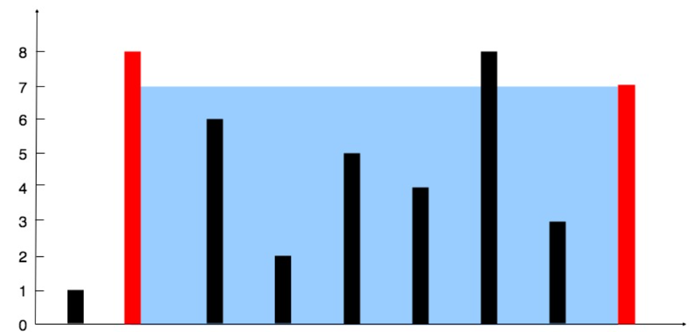
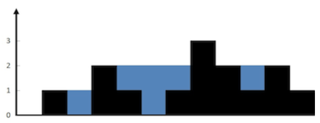
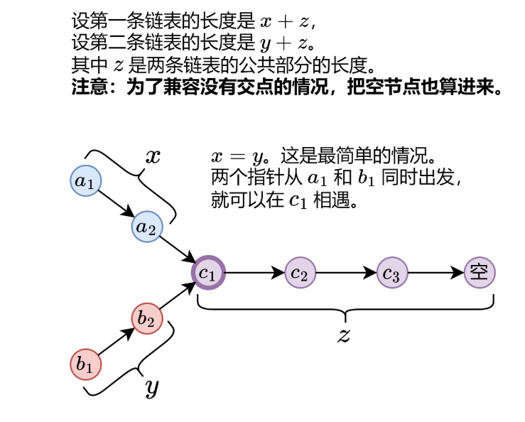
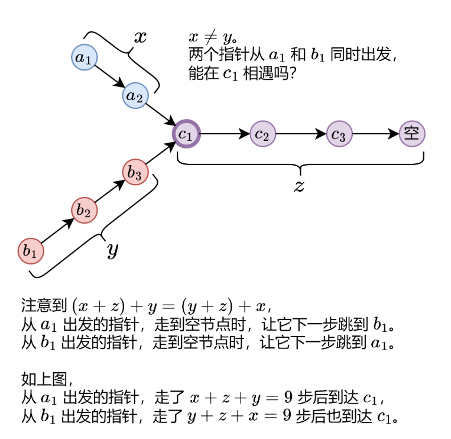
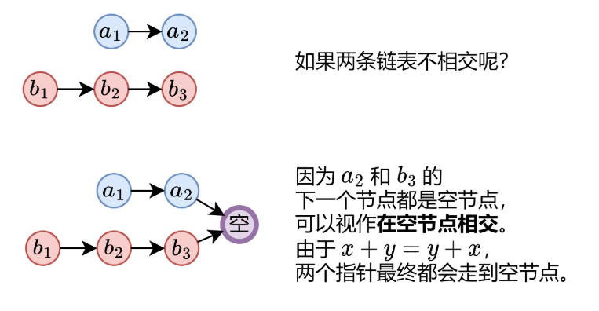
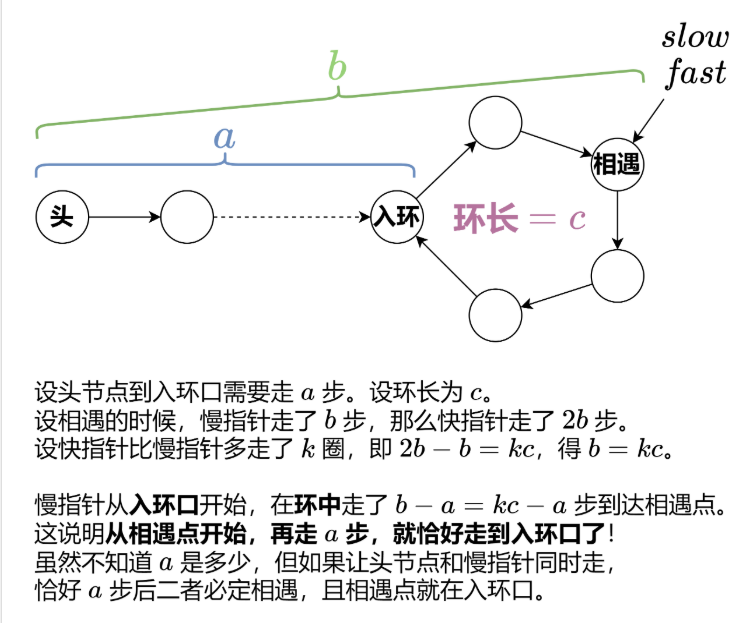
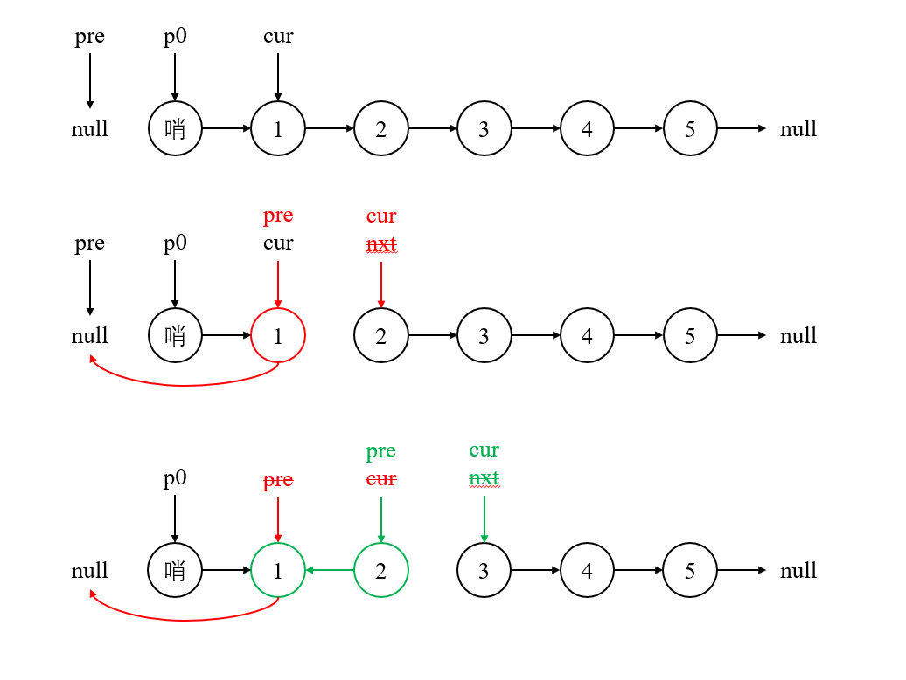
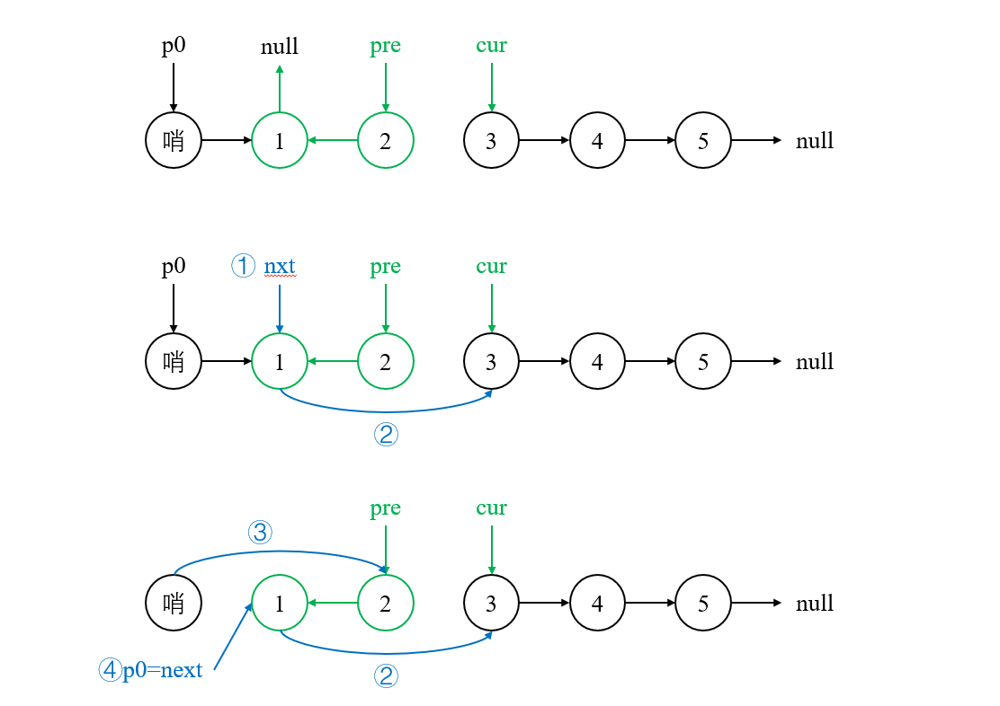

[toc]


hot100


# 一、哈希

## 1. 两数之和

[1. 两数之和](https://leetcode.cn/problems/two-sum/)

### 1. 题目描述

给定一个整数数组 `nums` 和一个整数目标值 `target`，请你在该数组中找出 **和为目标值** *`target`* 的那 **两个** 整数，并返回它们的数组下标。

你可以假设每种输入只会对应一个答案，并且你不能使用两次相同的元素。你可以按任意顺序返回答案。

**示例 1：**

```
输入：nums = [2,7,11,15], target = 9
输出：[0,1]
解释：因为 nums[0] + nums[1] == 9 ，返回 [0, 1] 。
```

**示例 2：**

```
输入：nums = [3,2,4], target = 6
输出：[1,2]
```

**示例 3：**

```
输入：nums = [3,3], target = 6
输出：[0,1]
```

**提示：**

- `2 <= nums.length <= 10^4`
- `-10^9 <= nums[i] <= 10^9`
- `-10^9 <= target <= 10^9`
- **只会存在一个有效答案**


**进阶：**你可以想出一个时间复杂度小于 $O(n^2)$ 的算法吗？


### 2. 思路

1）暴力求解

双重for循环，判断两层循环对应的元素之和是否为target。

Time: O(N^2), Space: O(1)

2）哈希表

建立哈希表，存储元素值与其索引值。先查找是否有target-num，再将不在哈希表中的元素加入到哈希表。

Time: O(N), Space:O(N)

### 3. 易错点

1）注意审题，返回的是索引下标，不是元素值。

2）要先查找，后插入。

3）注意使用的库函数是什么：find()。

4）find()的是target-nums[i]，不是nums[i]。

5）for循环需要有i，不要auto。

### 4. 题解

1）暴力求解

```cpp
class Solution {
public:
    vector<int> twoSum(vector<int>& nums, int target) {
         for (int i = 0; i < nums.size()-1; i++)
        {
            for (int j = i + 1; j < nums.size(); j++)
            {
                if (nums[i] + nums[j] == target)
                    return {i,j};
            }
        }
        return {0};
    }
};
```

2）哈希表

```cpp
class Solution {
public:
    vector<int> twoSum(vector<int>& nums, int target) {
        /*
        思路：哈希表
        Time: O(N), Space:O(N)
        */
        unordered_map<int, int> dic;
        // 1. 遍历数组，查找符合要求的元素对
        for (int i = 0; i < nums.size(); i++) {
            // 2. 查找与当前元素配对的元素是否在哈希表中
            auto it = dic.find(target - nums[i]);
            // 3. 不在，则将当前元素加入到哈希表中
            if (it == dic.end()) {
                dic[nums[i]] = i;
            } 
            // 4. 配对元素存在，则返回下标
            else {
                return {i, it->second};
            }
        }
        return {};
    }
};
```


## 49. 字母异位词分组

[49. 字母异位词分组](https://leetcode.cn/problems/group-anagrams/)

### 1. 题目描述

给你一个字符串数组，请你将 **字母异位词** 组合在一起。可以按任意顺序返回结果列表。

**字母异位词** 是由重新排列源单词的所有字母得到的一个新单词。

**示例 1:**

```
输入: strs = ["eat", "tea", "tan", "ate", "nat", "bat"]
输出: [["bat"],["nat","tan"],["ate","eat","tea"]]
```

**示例 2:**

```
输入: strs = [""]
输出: [[""]]
```

**示例 3:**

```
输入: strs = ["a"]
输出: [["a"]]
```

**提示：**

- `1 <= strs.length <= 10^4`
- `0 <= strs[i].length <= 100`
- `strs[i]` 仅包含小写字母

### 2. 思路

1）字符串排序+哈希表：将所有的异位词按字母大小排序后可以得到相同的单词。因此，key存放排序后的单词字符串，value存放异位词。

2）计数：统计每个单词中26个字母出现的次数，作为哈希表的键。


### 3. 易错点

ans.push_back(item.second);

注意是value，不是ans.push_back(item);


### 4. 题解

1）哈希表

```cpp
class Solution {
public:
    vector<vector<string>> groupAnagrams(vector<string>& strs) {
        /*
        思路：哈希表
        Time: O(n klogk), Space: O(nk), n=strs.size(), k=max(str.length)
        */
        unordered_map<string, vector<string>> dic;
        for (auto str : strs) {
            // 1. 先对所有的字符串进行排序
            string sort_str = str;
            sort(sort_str.begin(), sort_str.end());
            // 2. 并将其存储到对应的哈希表键值对中
            dic[sort_str].push_back(str);
        }
        vector<vector<string>> ans;
        // 3. 将所有的value给ans
        for (auto item : dic) {
            ans.push_back(item.second);
            // 注意是value，不是ans.push_back(item);
        }
        return ans;
    }
};
```

2）

```cpp
public:
    vector<vector<string>> groupAnagrams(vector<string>& strs) {
        unordered_map<string,vector<string>> map;
        for(string str:strs) {
            int counts[26] = {0};
            for(char c:str) {
                counts[c-'a']++;
            }
            string key = "";
            for(int i = 0;i<26;++i) {
                if(counts[i]!=0) {
                    key.push_back(i+'a');
                    key.push_back(counts[i]);
                }
            }
            map[key].push_back(str);
        }
        vector<vector<string>> res;
        for(auto& p:map) {
            res.push_back(p.second);
        }
        return res;
    }
};
```


## 128. 最长连续序列

[128. 最长连续序列](https://leetcode.cn/problems/longest-consecutive-sequence/)

### 1. 题目描述

给定一个未排序的整数数组 `nums` ，找出数字连续的最长序列（不要求序列元素在原数组中连续）的长度。请你设计并实现时间复杂度为 `O(n)` 的算法解决此问题。

**示例 1：**

```
输入：nums = [100,4,200,1,3,2]
输出：4
解释：最长数字连续序列是 [1, 2, 3, 4]。它的长度为 4。
```

**示例 2：**

```
输入：nums = [0,3,7,2,5,8,4,6,0,1]
输出：9
```

**提示：**

- `0 <= nums.length <= 10^5`
- `-10^9 <= nums[i] <= 10^9`

### 2. 思路

1）哈希集合

核心思路：对于 `nums` 中的元素 `x`，以 `x` 为起点，不断查找下一个数 `x+1`,`x+2`,⋯ 是否在 `nums` 中，并统计序列的长度。

把 `nums`中的数都放入一个哈希集合中，这样可以 O(1) 判断数字是否在 `nums`中。
如果 `x−1` 在哈希集合中，则不以 `x` 为起点。为什么？因为以 `x−1` 为起点计算出的序列长度，一定比以 `x` 为起点计算出的序列长度要长！这样可以避免大量重复计算。比如 `nums=[3,2,4,5]`，从 3 开始，我们可以找到 3,4,5 这个连续序列；而从 2 开始，我们可以找到 2,3,4,5 这个连续序列，一定比从 3 开始的序列更长。


### 3. 易错点

哈希集合，解题思路。

遍历哈希集合，不是遍历原nums。

### 4. 题解

1）哈希集合--cyq写的一坨

```cpp
class Solution {
public:
    int longestConsecutive(vector<int>& nums) {
        // 利用集合去除重复元素
        unordered_set<int> num;
        for(auto i:nums)
            num.insert(i); //注意是insert()不是push_back()
        
        // 优化写法：把 nums 转成哈希集合
        unordered_set<int> st(nums.begin(), nums.end());
        
        // 记录最长的序列长度
        int maxlength=0;
        // 记录当前序列长度
        int curlength=0;
        for(auto i:num){
            // 如果当前元素i的前一个元素i-1存在，则放弃该元素
            // 如果前一个元素不存在，则从当前元素开始计数
            if(!num.count(i-1)){
                int curnum=i; // 记录元素值
                curlength=1; // 初始化序列长度
                while(num.count(curnum+1)){ 
                    //当前元素的下一元素存在
                    curnum++;
                    curlength++;
                }
                maxlength=max(maxlength,curlength);
            }
            
        }
        return maxlength;
    }
};
```


```cpp
class Solution {
public:
    int longestConsecutive(vector<int>& nums) {
        int ans = 0;
        // 把 nums 转成哈希集合
        unordered_set<int> st(nums.begin(), nums.end()); 
        for (int x : st) { // 遍历哈希集合
            if (st.contains(x - 1)) {
                continue;
            }
            // x 是序列的起点
            int y = x + 1;
            while (st.contains(y)) { // 不断查找下一个数是否在哈希集合中
                y++;
            }
            // 循环结束后，y-1 是最后一个在哈希集合中的数
            ans = max(ans, y - x); // 从 x 到 y-1 一共 y-x 个数
        }
        return ans;
    }
};
```


# 二、双指针

## 283. 移动零

[283. 移动零](https://leetcode.cn/problems/move-zeroes/)

### 1. 题目描述

给定一个数组 `nums`，编写一个函数将所有 `0` 移动到数组的末尾，同时==保持非零元素的相对顺序。==

**请注意** ，必须在不复制数组的情况下原地对数组进行操作。

**示例 1:**

```
输入: nums = [0,1,0,3,12]
输出: [1,3,12,0,0]
```

**示例 2:**

```
输入: nums = [0]
输出: [0]
```

 **提示**:

- `1 <= nums.length <= 10^4`
- `-2^31 <= nums[i] <= 2^31 - 1`

**进阶：**你能尽量减少完成的操作次数吗？

### 2. 思路

使用**同向的**双指针，左指针指向当前已经处理好的序列的尾部，右指针指向待处理序列的头部。

右指针不断向右移动，每次**右指针指向==非零数==**，则将左右指针对应的数交换，同时左指针右移。

注意到以下性质：

- 左指针左边均为非零数；


- 右指针左边直到左指针处均为零。


因此每次交换，都是将左指针的零与右指针的非零数交换，且非零数的相对顺序并未改变。

### 3. 易错点


### 4. 题解

1）双指针+交换

```cpp
class Solution {
public:
    void moveZeroes(vector<int>& nums) {
        int left = 0, right = 0;
        while (right < nums.size()) {
            if (nums[right] != 0) {
                swap(nums[left], nums[right]);
                left++;
            }
            right++;
        }
    }
};
```

2）双指针+覆盖+末尾重新覆盖0

```cpp
void moveZeroes(vector<int> &nums)
{
    int slow = 0;
    int fast = 0;
    while (fast < nums.size())
    {
        if (nums[fast] != 0)
        {
            nums[slow] = nums[fast];
            slow++;
            fast++;
        }
        else
            fast++;
    }
    while (slow < nums.size())
        nums[slow++] = 0;
}
```


### 5. 延申

#### 27. 移除元素

https://leetcode.cn/problems/remove-element/description/

令`val=0`，则变为283. 移动零，但本题不要求k之后的元素的值，283要求后续元素为0。


**题目描述：**给你一个数组 `nums` 和一个值 `val`，你需要**原地**移除所有数值等于 `val` 的元素。==元素的顺序可能发生改变。==然后返回 `nums` 中与 `val` 不同的元素的数量。

假设 `nums` 中不等于 `val` 的元素数量为 `k`，要通过此题，您需要执行以下操作：

- 更改 `nums` 数组，使 `nums` 的前 `k` 个元素包含不等于 `val` 的元素。==`nums` 的其余元素和 `nums` 的大小并不重要。==
- 返回 `k`。


**思路：**

1）同向双指针：

右指针 right 指向当前将要处理的元素，左指针 left 指向下一个将要赋值的位置。如果右指针指向的元素不等于 val，它一定是输出数组的一个元素，我们就将右指针指向的元素复制到左指针位置，然后将左右指针同时右移；如果右指针指向的元素等于 val，它不能在输出数组里，此时左指针不动，右指针右移一位。

2）相向双指针：

如果要移除的元素恰好在数组的开头，例如序列 [1,2,3,4,5]，当 *val* 为 1 时，我们需要把每一个元素都左移一位。【注意边界判断】

如果左指针 left 指向的元素等于 val，此时将右指针 right 指向的元素复制到左指针 left 的位置，然后右指针 right 左移一位。如果赋值过来的元素恰好也等于 val，可以继续把右指针 right 指向的元素的值赋值过来（左指针 left 指向的等于 val 的元素的位置继续被覆盖），直到左指针指向的元素的值不等于 val 为止。


3）通解：

如果当前元素 x 与移除元素 val 相同，那么跳过该元素。
如果当前元素 x 与移除元素 val 不同，那么我们将其放到下标 idx 的位置，并让 idx 自增右移。【感觉本质上还是同向双指针】


**题解：**

1）同向双指针

```cpp
class Solution {
public:
    int removeElement(vector<int>& nums, int val) {
        /*
        思路1：同向双指针，Time: O(N), Space: O(1)
        */
        int left = 0, right = 0;
        while (right < nums.size()) {
            if (nums[right] != val) {
                nums[left] = nums[right];
                left++;
            }
            right++;
        }
        return left;
    }
};
```

2）相向双指针

```cpp
class Solution {
public:
    int removeElement(vector<int>& nums, int val) {
        int left = 0, right = nums.size() - 1;
        while (left <= right) {
            if (nums[left] != val)
                left++;
            else if (nums[left] == val) {
                nums[left] = nums[right];
                right--;
            }
        }
        return left;
    }
};
```

3）通解

```cpp
class Solution {
public:
    int removeElement(vector<int>& nums, int val) {
        int index = 0;
        for (auto num : nums) {
            if (num != val) {
                nums[index] = num;
                index++;
            }
        }
        return index;
    }
};
```


#### 26. 删除排序数组中的重复项

https://leetcode.cn/problems/remove-duplicates-from-sorted-array/

**题目描述：**给你一个 **非严格递增排列** 的数组 `nums` ，请你**原地**删除重复出现的元素，使每个元素 **只出现一次** ，返回删除后数组的新长度。==元素的 **相对顺序** 应该保持 **一致** 。==然后返回 `nums` 中唯一元素的个数。

考虑 `nums` 的唯一元素的数量为 `k` ，你需要做以下事情确保你的题解可以被通过：

- 更改数组 `nums` ，使 `nums` 的前 `k` 个元素包含唯一元素，并按照它们最初在 `nums` 中出现的顺序排列。`nums` 的其余元素与 `nums` 的大小不重要。
- 返回 `k` 。

**思路：**

1）同向双指针：

双指针，left指向上一次【处理好】的位置，right去查找后续元素。由于是非严格递增排列，所以nums[left]<=nums[right]，right指向第一个出现的重复元素时，left指向的元素是小于right的，而将该元素赋给left后，重复元素又与该元素值相同，right++。

2）通解：

为了让解法更具有一般性，我们将原问题的「最多保留 1 位」修改为「最多保留 k 位」。由于是保留 k 个相同数字，对于前 k 个数字，我们可以直接保留。对于后面的任意数字，能够保留的前提是：与当前写入的位置前面的第 k 个元素进行比较，不相同则保留。【注意判断条件：index < k || nums[index - k] != num】


题解：

1）双指针

```cpp
class Solution {
public:
    int removeDuplicates(vector<int>& nums) {
        /*
        思路：双指针，left指向上一次【处理好】的位置，right去查找后续元素
        由于是非严格递增排列，所以nums[left]<=nums[right]
        right指向第一个出现的重复元素时，left指向的元素是小于right的
        而将该元素赋给left后，重复元素又与该元素值相同，right++
        Time: O(N), Space: O(1)
        */
    int removeDuplicates(vector<int>& nums) {
        int left = 1, right = 1;
        while (right < nums.size()) {
            if (nums[right] != nums[left - 1]) {
                nums[left] = nums[right];
                left++;
            }
            right++;
        }
        return left;
    }
};

```

2）通解

```cpp
class Solution {
public:
    int removeDuplicates(vector<int>& nums) {
        return process(nums,1);
    }
    // 注意是引用类型的
    int process(vector<int>& nums,int k){
        int idx = 0;
        for(auto x : nums){
            // 前k个直接保留
            // 后续元素需要保证和前面第k个不相同
            if(idx < k or nums[idx - k] != x){
                nums[idx++] = x;
            }
        }
        return idx;  
    }
};
```


#### 80. 删除排序数组中的重复项II

https://leetcode.cn/problems/remove-duplicates-from-sorted-array-ii/description/

**题目描述：**给你一个有序数组 `nums` ，请你**原地** 删除重复出现的元素，使得出现次数超过两次的元素**只出现两次** ，返回删除后数组的新长度。

不要使用额外的数组空间，你必须在**原地** 并在使用 O(1) 额外空间的条件下完成。

思路：

1）双指针：定义快慢指针left和right，left表示存放下一个元素的位置，right指向当前需要处理的元素。将nums[right]和nums[left-2]进行比较，不同则赋值。

2）通用解：和双指针思想类似，将nums[right]和nums[left-k]进行比较。

3）栈：和上述两种方法思路类似。


题解：

1）双指针

```cpp
class Solution {
public:
    int removeDuplicates(vector<int>& nums) {
        // 当前元素个数小于2，则符合题意，直接返回长度
        if (nums.size() <= 2)
            return nums.size();
        // 元素个数多余2，则利用快慢指针进行判断
        int left = 2, right = 2;
        while (right < nums.size()) {
            // 右指针元素与当前处理好的倒数第二个元素不同，则保存
            if (nums[right] != nums[left - 2]) {
                nums[left] = nums[right];
                left++;
            }
            right++;
        }
        return left;
    }
};
```

2）通用解法

```cpp
class Solution {
public:
    int removeDuplicates(vector<int>& nums) {
        return process(nums,2);
    }
    // 注意是引用类型的
    int process(vector<int>& nums,int k){
        int idx = 0;
        for(auto x : nums){
            // 前k个直接保留
            // 后续元素需要保证和前面第k个不相同
            if(idx < k or nums[idx - k] != x){
                nums[idx++] = x;
            }
        }
        return idx;  
    }
};
```

3）栈的思想

```cpp
class Solution {
public:
    int removeDuplicates(vector<int>& nums) {
        int n = nums.size();
        int stack_size = 2; // 栈的大小，前两个元素默认保留
        for (int i = 2; i < n; i++) {
            if (nums[i] != nums[stack_size - 2]) { // 和栈顶下方的元素比较
                nums[stack_size++] = nums[i]; // 入栈
            }
        }
        return min(stack_size, n);
    }
};
```


## 11. 盛水最多的容器

https://leetcode.cn/problems/container-with-most-water/

### 1. 题目描述

给定一个长度为 `n` 的整数数组 `height` 。有 `n` 条垂线，第 `i` 条线的两个端点是 `(i, 0)` 和 `(i, height[i])` 。

找出其中的两条线，使得它们与 `x` 轴共同构成的容器可以容纳最多的水。

返回容器可以储存的最大水量。

**说明：**你不能倾斜容器。

**示例 1：**



```
输入：[1,8,6,2,5,4,8,3,7]
输出：49 
```

**示例 2：**

```
输入：height = [1,1]
输出：1
```

**提示：**

- `n == height.length`
- `2 <= n <= 10^5`
- `0 <= height[i] <= 10^4`

### 2. 思路

> 我们left++和right--都是为了尝试取到更多的水，如果短的板不动的话，取到的水永远不会比上次多。
>
> 能盛多少水由短板决定，抛弃最黑暗的自己，才能有未来


相向双指针，取水量为min(left,right)*(right-left)，每次移动矮的指针。


### 3. 易错点

思路。

注意left和right是表示index的指针，不是表示height的。

### 4. 题解

1）双指针

```cpp
class Solution {
public:
    int maxArea(vector<int>& height) {
        /*
        思路：双指针
        Time: O(N), Space: O(1)
        */
        int ans = 0;
        int left = 0, right = height.size() - 1;
        while (left < right) {
            // 计算当前储水量，和历史最大值比较，大则更新
            ans = max(ans, (right - left) * min(height[left], height[right]));
            // 移动短板
            if (height[left] <= height[right])
                left++;
            else
                right--;
        }
        return ans;
    }
};
```

2）


## 15. 三数之和

https://leetcode.cn/problems/3sum/


### 1. 题目描述

给你一个整数数组 `nums` ，判断是否存在三元组 `[nums[i], nums[j], nums[k]]` 满足 `i != j`、`i != k` 且 `j != k` ，同时还满足 `nums[i] + nums[j] + nums[k] == 0` 。请你返回所有和为 `0` 且==不重复==的三元组。

**注意：**答案中不可以包含重复的三元组。


**示例 1：**

```
输入：nums = [-1,0,1,2,-1,-4]
输出：[[-1,-1,2],[-1,0,1]]
解释：
nums[0] + nums[1] + nums[2] = (-1) + 0 + 1 = 0 。
nums[1] + nums[2] + nums[4] = 0 + 1 + (-1) = 0 。
nums[0] + nums[3] + nums[4] = (-1) + 2 + (-1) = 0 。
不同的三元组是 [-1,0,1] 和 [-1,-1,2] 。
注意，输出的顺序和三元组的顺序并不重要。
```

**示例 2：**

```
输入：nums = [0,1,1]
输出：[]
解释：唯一可能的三元组和不为 0 。
```

**示例 3：**

```
输入：nums = [0,0,0]
输出：[[0,0,0]]
解释：唯一可能的三元组和为 0 。
```

**提示：**

- `3 <= nums.length <= 3000`
- `-10^5 <= nums[i] <= 10^5`


### 2. 思路

「==不重复==」的本质是什么？我们保持三重循环的大框架不变，只需要保证：

- 第二重循环枚举到的元素**不小于**当前第一重循环枚举到的元素；

- 第三重循环枚举到的元素**不小于**当前第二重循环枚举到的元素。


也就是说，我们枚举的三元组 (a,b,c) 满足 a≤b≤c，保证了只有 (a,b,c) 这个顺序会被枚举到，而 (b,a,c)、(c,b,a) 等等这些不会，这样就减少了重复。要实现这一点，我们可以将数组中的元素从小到大进行**排序**，随后使用普通的三重循环就可以满足上面的要求。

同时，对于每一重循环而言，相邻两次枚举的元素不能相同，否则也会造成重复。

从小到大枚举 *b*，**同时**从大到小枚举 *c*，即**第二重循环和第三重循环实际上是并列的关系**。

1）排序+双指针：

Time: O(N^2), Space:O(1)

### 3. 易错点

去重！！！

重复元素跳过的判定条件！！

### 4. 题解

1）排序+双指针

```cpp
class Solution {
public:
    vector<vector<int>> threeSum(vector<int>& nums) {
        if (nums.size() <= 2)
            return {};
        vector<vector<int>> ans;
        // 1. 排序
        sort(nums.begin(), nums.end());
        // 2. 进行遍历
        for (int i = 0; i < nums.size() - 2; i++) {
            // 3. 重复元素跳过
            if (i > 0 && nums[i] == nums[i - 1])
                continue;
            // 4. 使用相向双指针
            int left = i + 1, right = nums.size() - 1;
            int target = -nums[i];
            // 5. 循环条件：左右指针未相遇
            while (left < right) {
                int sum = nums[left] + nums[right];
                // 6. 找到符合条件的，添加到ans
                // 7. 左指针、右指针移动，同时【判断重复】！
                if (sum == target) {
                    ans.push_back({nums[i], nums[left], nums[right]});
                    left++;
                    right--;
                    while (left < right && nums[left] == nums[left - 1])
                        left++;
                    while (left < right && nums[right] == nums[right + 1])
                        right--;
                }
                // 8. 不符合要求，判断移动哪个指针
                else if (sum < target) {
                    left++;
                } else
                    right--;
            }
        }
        return ans;
    }
};
```

2）优化版

```cpp
class Solution {
public:
    vector<vector<int>> threeSum(vector<int>& nums) {
        ranges::sort(nums);
        vector<vector<int>> ans;
        int n = nums.size();
        for (int i = 0; i < n - 2; i++) {
            int x = nums[i];
            if (i && x == nums[i - 1]) continue; // 跳过重复数字
            if (x + nums[i + 1] + nums[i + 2] > 0) break; // 优化一
            if (x + nums[n - 2] + nums[n - 1] < 0) continue; // 优化二
            int j = i + 1, k = n - 1;
            while (j < k) {
                int s = x + nums[j] + nums[k];
                if (s > 0) {
                    k--;
                } else if (s < 0) {
                    j++;
                } else { // 三数之和为 0
                    ans.push_back({x, nums[j], nums[k]});
                    for (j++; j < k && nums[j] == nums[j - 1]; j++); // 跳过重复数字
                    for (k--; k > j && nums[k] == nums[k + 1]; k--); // 跳过重复数字
                }
            }
        }
        return ans;
    }
};
```


## 42. 接雨水

https://leetcode.cn/problems/trapping-rain-water/description/

### 1. 题目描述

题目描述：给定 `n` 个非负整数表示每个宽度为 `1` 的柱子的高度图，计算按此排列的柱子，下雨之后能接多少雨水。

**示例 1：**



```
输入：height = [0,1,0,2,1,0,1,3,2,1,2,1]
输出：6
解释：上面是由数组 [0,1,0,2,1,0,1,3,2,1,2,1] 表示的高度图，在这种情况下，可以接 6 个单位的雨水（蓝色部分表示雨水）。 
```

**示例 2：**

```
输入：height = [4,2,0,3,2,5]
输出：9
```

**提示：**

- `n == height.length`
- `1 <= n <= 2 * 10^4`
- `0 <= height[i] <= 10^5`


### 2. 思路

1）DP：三次遍历，第一次正向遍历记录每个位置左侧的最大值，第二次反向遍历记录每个位置右侧的最大值，第三次进行储水量的计算。

2）双指针：由于数组 *leftMax* 是从左往右计算，数组 *rightMax* 是从右往左计算，因此可以使用双指针和两个变量代替两个数组。

### 3. 易错点

1）DP：注意边界情况

2）双指针：

### 4. 题解

1）动态规划

```cpp
int trap(vector<int> &height)
{
    /* 动态规划DP Time: O(N) Space: O(N)*/
    /*
        核心：每一个位置的雨水量怎么求。注意每一次遍历的区间取值范围。
        思路：三次遍历，
            1. 第一次找每一个位置左侧最大的高度
            2. 第二次找每一个位置右侧最大的高度
            3. 第三次根据当前高度、左侧高度、右侧高度计算出该位置能存放的最大雨水量
    */

    // 左侧最大高度记录，注意特殊位置处理
    vector<int> leftmax(height.size());
    leftmax[0] = height[0];
    // 右侧最大高度记录，注意特殊位置处理
    vector<int> rightmax(height.size());
    rightmax[height.size() - 1] = height[height.size() - 1];

    int sumrain = 0; // 记录雨水总量
    // 1 遍历，记录左侧最大高度
    for (int i = 1; i < height.size(); i++)
        leftmax[i] = max(leftmax[i - 1], height[i]);
    // 2 遍历，记录右侧最大高度
    for (int i = height.size() - 2; i >= 0; i--)
        rightmax[i] = max(rightmax[i + 1], height[i]);
    // 3 遍历，求每个位置的最大雨水量
    for (int i = 0; i < height.size(); i++)
    {
        int currain = min(leftmax[i], rightmax[i]) - height[i];
        sumrain += currain;
    }
    return sumrain;
}
```

2）双指针

```cpp
class Solution {
public:
    int trap(vector<int>& height) {
        int ans = 0;
        // 左右指针
        int left = 0, right = height.size() - 1;
        // 记录左侧最大值与右侧最大值
        int leftmax = 0, rightmax = 0;
        while (left < right) {
            // 计算左指针和右指针对应位置两侧的最高值
            leftmax = max(leftmax, height[left]);
            rightmax = max(rightmax, height[right]);
            // 移动短板，记录该位置的储水量
            if (leftmax <= rightmax) {
                ans += leftmax - height[left];
                left++;
            } else {
                ans += rightmax - height[right];
                right--;
            }
        }
        return ans;
    }
};
```


# 三、滑动窗口

## 3. 无重复字符的最长子串

https://leetcode.cn/problems/longest-substring-without-repeating-characters/

### 1. 题目描述

给定一个字符串 `s` ，请你找出其中不含有重复字符的 **最长子串** 的长度。

**示例 1:**

```
输入: s = "abcabcbb"
输出: 3 
解释: 因为无重复字符的最长子串是 "abc"，所以其长度为 3。
```

**示例 2:**

```
输入: s = "bbbbb"
输出: 1
解释: 因为无重复字符的最长子串是 "b"，所以其长度为 1。
```

**示例 3:**

```
输入: s = "pwwkew"
输出: 3
解释: 因为无重复字符的最长子串是 "wke"，所以其长度为 3。
     请注意，你的答案必须是 子串 的长度，"pwke" 是一个子序列，不是子串。
```

 **提示：**

- `0 <= s.length <= 5 * 10^4`
- `s` 由英文字母、数字、符号和空格组成


### 2. 思路

1）哈希集合+滑动窗口

用哈希集合记录窗口中的元素，当窗口将要添加的元素已经在窗口中出现过时，则将窗口左侧元素移除，直至新加入的元素不在窗口中。将新元素加入窗口，比较长度。

2）哈希表+滑动窗口

哈希表作为计数器，记录滑动窗口内出现的元素以及次数。当要加入到窗口中的元素的计数＞1时，不符合要求，则将窗口左侧元素移除，直至窗口中只包含该元素的个数为1。比较maxlen。

### 3. 易错点


### 4. 题解

1）哈希集合+滑动窗口

```cpp
class Solution {
public:
    int lengthOfLongestSubstring(string s) {
        /*
        思路：哈希集合+滑动窗口
        Time:O(N), Space: O(N)
        */
        unordered_set<char> window;
        int left = 0, right = 0;
        int maxlen = 0;
        for (; right < s.length(); right++) {
            char c = s[right];
            // 如果窗口内已经包含 c，再加入 c 会导致窗口内有重复元素
            // 所以要在加入 c 之前，先移出窗口内的 c
            while (window.contains(c)) {
                window.erase(s[left]);
                left++;
            }
            window.insert(c);
            maxlen = max(maxlen, right - left + 1);
        }
        return maxlen;
    }
};
```

2）哈希表+滑动窗口

```cpp
class Solution {
public:
    int lengthOfLongestSubstring(string s) {
        int n = s.length(), ans = 0, left = 0;
        unordered_map<char, int> cnt; // 维护从下标 left 到下标 right 的字符
        for (int right = 0; right < n; right++) {
            char c = s[right];
            cnt[c]++;
            while (cnt[c] > 1) { // 窗口内有重复字母
                cnt[s[left]]--; // 移除窗口左端点字母
                left++; // 缩小窗口
            }
            ans = max(ans, right - left + 1); // 更新窗口长度最大值
        }
        return ans;
    }
};
```


## 438. 找到字符串中所有字母异位词

https://leetcode.cn/problems/find-all-anagrams-in-a-string/

### 1. 题目描述

给定两个字符串 `s` 和 `p`，找到 `s` 中所有 `p` 的 **异位词** 的子串，返回这些子串的起始索引。不考虑答案输出的顺序。

**示例 1:**

```
输入: s = "cbaebabacd", p = "abc"
输出: [0,6]
解释:
起始索引等于 0 的子串是 "cba", 它是 "abc" 的异位词。
起始索引等于 6 的子串是 "bac", 它是 "abc" 的异位词。
```

 **示例 2:**

```
输入: s = "abab", p = "ab"
输出: [0,1,2]
解释:
起始索引等于 0 的子串是 "ab", 它是 "ab" 的异位词。
起始索引等于 1 的子串是 "ba", 它是 "ab" 的异位词。
起始索引等于 2 的子串是 "ab", 它是 "ab" 的异位词。
```

 **提示:**

- `1 <= s.length, p.length <= 3 * 10^4`
- `s` 和 `p` 仅包含小写字母


### 2. 思路

1）定长滑动窗口

枚举 $s$ 所有长度与 $p$ 相同的字串 $s'$，比较 $s'$ 与 $p$ 中每个字母出现的次数是否相同。

- 时间复杂度：O(∣Σ∣*m*+*n*)，其中 *m* 是 *s* 的长度，*n* 是 *p* 的长度，∣Σ∣=26 是字符集合的大小。
- 空间复杂度：O(∣Σ∣)。返回值不计入。


2）不定长滑动窗口

枚举子串 $s'$ 的右端点，如果 $s'$ 中某个字母出现次数**大于** $p$ 中字母出现的次数，则右移 $s'$ 的左端点。

如果发现 $s'$  的==长度等于== $p$ 的长度，则说明 $s'$  的每种字母的出现次数和 $p$ 的每种字母的出现次数都相同（如果出现次数 $s'$  的小于 $p$ 的，不可能长度一样），那么 $s'$ 是 $p$ 的异位词。

对于 $p$ 的字母 $c$，把 `cnt[c]` 加一。对于 $s'$  的字母 $c$，把 `cnt[c]` 减一。如果 `cnt[c]<0`，说明窗口中的字母 c 的个数比 p 的多，右移左端点。

- 时间复杂度：O(m+n)，其中 m 是 s 的长度，n 是 p 的长度。虽然写了个二重循环，但是内层循环中对 left 加一的总执行次数不会超过 m 次，所以滑窗的时间复杂度为 O(m)。
- 空间复杂度：O(∣Σ∣)，其中 ∣Σ∣=26 是字符集合的大小。返回值不计入。


### 3. 易错点


### 4. 题解

1）定长滑动窗口

```cpp
class Solution {
public:
    vector<int> findAnagrams(string s, string p) {
        vector<int> ans;
        array<int, 26> cnt_p{}; // 统计 p 的每种字母的出现次数
        array<int, 26> cnt_s{}; // 统计 s 的长为 p.length() 的子串 s' 的每种字母的出现次数
        for (char c : p) {
            cnt_p[c - 'a']++;
        }
        for (int right = 0; right < s.length(); right++) {
            cnt_s[s[right] - 'a']++; // 右端点字母进入窗口
            int left = right - p.length() + 1;
            if (left < 0) { // 窗口长度不足 p.length()
                continue;
            }
            if (cnt_s == cnt_p) { // s' 和 p 的每种字母的出现次数都相同
                ans.push_back(left); // s' 左端点下标加入答案
            }
            cnt_s[s[left] - 'a']--; // 左端点字母离开窗口
        }
        return ans;
    }
};
```

2）不定长滑动窗口

```cpp
class Solution {
public:
    vector<int> findAnagrams(string s, string p) {
        vector<int> ans;
        int cnt[26]{}; // 统计 p 的每种字母的出现次数
        for (char c : p) {
            cnt[c - 'a']++;
        }
        int left = 0;
        for (int right = 0; right < s.size(); right++) {
            int c = s[right] - 'a';
            cnt[c]--; // 右端点字母进入窗口
            while (cnt[c] < 0) { // 字母 c 太多了
                cnt[s[left] - 'a']++; // 左端点字母离开窗口
                left++; 
            }
            if (right - left + 1 == p.length()) { // s' 和 p 的每种字母的出现次数都相同
                ans.push_back(left); // s' 左端点下标加入答案
            }
        }
        return ans;
    }
};
```

### 5. 延申【定长窗口】

#### 1456. 定长子串中元音的最大数目

https://leetcode.cn/problems/maximum-number-of-vowels-in-a-substring-of-given-length/description/

题目描述：给你字符串 `s` 和整数 `k` 。请返回字符串 `s` 中长度为 `k` 的单个子字符串中可能包含的最大元音字母数。英文中的 **元音字母** 为（`a`, `e`, `i`, `o`, `u`）。

 **示例 1：**

```
输入：s = "abciiidef", k = 3
输出：3
解释：子字符串 "iii" 包含 3 个元音字母。
```

**示例 2：**

```
输入：s = "aeiou", k = 2
输出：2
解释：任意长度为 2 的子字符串都包含 2 个元音字母。
```

**示例 3：**

```
输入：s = "leetcode", k = 3
输出：2
解释："lee"、"eet" 和 "ode" 都包含 2 个元音字母。
```

**示例 4：**

```
输入：s = "rhythms", k = 4
输出：0
解释：字符串 s 中不含任何元音字母。
```

**示例 5：**

```
输入：s = "tryhard", k = 4
输出：1
```

**提示：**

- `1 <= s.length <= 10^5`
- `s` 由小写英文字母组成
- `1 <= k <= s.length`

**思路：**我们要计算所有长度**恰好**为 *k* 的子串中，最多可以包含多少个元音字母。选用定长滑动窗口，分为三步：

1. **入**：下标为 *i* 的元素进入窗口，更新相关统计量。如果 *i*<*k*−1 则重复第一步。
2. **更新**：更新答案。一般是更新最大值/最小值。
3. **出**：下标为 *i*−*k*+1 的元素离开窗口，更新相关统计量。


**题解：**

```cpp
class Solution {
public:
    int maxVowels(string s, int k) {
        int ans = 0;
        int cnt = 0;
        for (int right = 0; right < s.size(); right++) {
            // 1. 下标为 right 的元素进入窗口，更新统计变量
            if (s[right] == 'a' || s[right] == 'e' || s[right] == 'i' ||
                s[right] == 'o' || s[right] == 'u')
                cnt++;
            if (right < k - 1)
                continue;
            // 2. 更新答案
            ans = max(ans, cnt);
            // 3. 下标为 right - k + 1的元素离开窗口，更新统计变量
            int left = right - k + 1;
            if (s[left] == 'a' || s[left] == 'e' || s[left] == 'i' ||
                s[left] == 'o' || s[left] == 'u')
                cnt--;
        }
        return ans;
    }
};
```

#### [643. 子数组最大平均数 I](https://leetcode.cn/problems/maximum-average-subarray-i/)

#### [1343. 大小为 K 且平均值大于等于阈值的子数组数目](https://leetcode.cn/problems/number-of-sub-arrays-of-size-k-and-average-greater-than-or-equal-to-threshold/)

#### [567. 字符串的排列](https://leetcode.cn/problems/permutation-in-string/)

#### [2841. 几乎唯一子数组的最大和](https://leetcode.cn/problems/maximum-sum-of-almost-unique-subarray/)

#### [2461. 长度为 K 子数组中的最大和](https://leetcode.cn/problems/maximum-sum-of-distinct-subarrays-with-length-k/)


# 四、子串

## 560. 和为K 的子数组

[560. 和为 K 的子数组](https://leetcode.cn/problems/subarray-sum-equals-k/)

### 1. 题目描述

给你一个整数数组 `nums` 和一个整数 `k` ，请你统计并返回 *该数组中和为 `k` 的子数组的==个数==* 。

子数组是数组中元素的连续非空序列。

 **示例 1：**

```
输入：nums = [1,1,1], k = 2
输出：2
```

**示例 2：**

```
输入：nums = [1,2,3], k = 3
输出：2
```

**提示：**

- `1 <= nums.length <= 2 * 10^4`
- `-1000 <= nums[i] <= 1000`
- `-10^7 <= k <= 10^7`

### 2. 思路

1）两次遍历

第一次遍历构造前缀和数组，第二次遍历前缀和数组，查找当前元素之前的前缀和有没有满足s[i]=s[j]-k的，有的话，[i,j-1]为符合条件的子区间。

2）一次遍历

一边计算前缀和，一边遍历前缀和。需要先单独处理s[0]=0

时间复杂度：O(N)，空间复杂度：O(N)

### 3. 易错点

1）哈希表存的cnt，ans+=cnt，不是ans+=1

2）遍历s求解

3）先判断有没有，再累加

### 4. 题解

1）两次遍历

```cpp
class Solution {
public:
    int subarraySum(vector<int>& nums, int k) {
        vector<int> s(nums.size() + 1);
        for (int i = 0; i < nums.size(); i++) {
            s[i + 1] = s[i] + nums[i];
        }
        unordered_map<int, int> cnt;
        int ans = 0;
        // 注意是遍历s
        for (auto num : s) {
            if (cnt.contains(num - k))
                ans += cnt[num - k];
            cnt[num]++;
        }
        return ans;
    }
};
```

2）一次遍历

```cpp
class Solution {
public:
    int subarraySum(vector<int>& nums, int k) {
        int ans = 0, s = 0;
        unordered_map<int, int> cnt{{0, 1}}; // s[0]=0 单独统计
        for (int x : nums) {
            s += x;
            // 注意不要直接 += cnt[s-k]，如果 s-k 不存在，会插入 s-k
            ans += cnt.contains(s - k) ? cnt[s - k] : 0;
            cnt[s]++;
        }
        return ans;
    }
};
```


### 5. 延申

#### 930. 和相同的二元子数组

[930. 和相同的二元子数组](https://leetcode.cn/problems/binary-subarrays-with-sum/)

题目描述：给你一个二元数组 `nums` ，和一个整数 `goal` ，请你统计并返回有==多少个==和为 `goal` 的 **非空** 子数组。**子数组** 是数组的一段连续部分。

 **示例 1：**

```
输入：nums = [1,0,1,0,1], goal = 2
输出：4
解释：
有 4 个满足题目要求的子数组：[1,0,1]、[1,0,1,0]、[0,1,0,1]、[1,0,1]
```

**示例 2：**

```
输入：nums = [0,0,0,0,0], goal = 0
输出：15
```

 **提示：**

- `1 <= nums.length <= 3 * 10^4`
- `nums[i]` 不是 `0` 就是 `1`
- `0 <= goal <= nums.length`

**思路：**把560的k改成goal，两次遍历/一次遍历。

**题解：**

```cpp
class Solution {
public:
    int numSubarraysWithSum(vector<int>& nums, int goal) {
        vector<int> s(nums.size() + 1);
        for (int i = 0; i < nums.size(); i++)
            s[i + 1] = s[i] + nums[i];
        unordered_map<int, int> cnt;
        int ans = 0;
        for (int i = 0; i < s.size(); i++) {
            if (cnt.contains(s[i] - goal))
                ans += cnt[s[i] - goal];
            cnt[s[i]]++;
        }
        return ans;
    }
};
```


#### 523. 连续的子数组和

[523. 连续的子数组和](https://leetcode.cn/problems/continuous-subarray-sum/)

**题目描述：**

给你一个整数数组 `nums` 和一个整数 `k` ，==如果 `nums` 有==一个 **好的子数组** 返回 `true` ，否则返回 `false`：

一个 **好的子数组** 是：

- 长度 **至少为 2** ，且
- 子数组元素总和为 `k` 的倍数。

**注意**：

- **子数组** 是数组中 **连续** 的部分。
- 如果存在一个整数 `n` ，令整数 `x` 符合 `x = n * k` ，则称 `x` 是 `k` 的一个倍数。`0` **始终** 视为 `k` 的一个倍数。

**示例 1：**

```
输入：nums = [23,2,4,6,7], k = 6
输出：true
解释：[2,4] 是一个大小为 2 的子数组，并且和为 6 。
```

**示例 2：**

```
输入：nums = [23,2,6,4,7], k = 6
输出：true
解释：[23, 2, 6, 4, 7] 是大小为 5 的子数组，并且和为 42 。 
42 是 6 的倍数，因为 42 = 7 * 6 且 7 是一个整数。
```

**示例 3：**

```
输入：nums = [23,2,6,4,7], k = 13
输出：false
```

 **提示：**

- `1 <= nums.length <= 10^5`
- `0 <= nums[i] <= 10^9`
- `0 <= sum(nums[i]) <= 2^31 - 1`
- `1 <= k <= 2^31 - 1`

**思路：**

注意审题，有一个就行，不用计数，也不用关注是不是最长。

哈希表记录下标，判断条件：下标之差>2

**题解：**

```cpp
class Solution {
public:
    bool checkSubarraySum(vector<int>& nums, int k) {
        if (nums.size() < 2)
            return false;
        unordered_map<int, int> cnt{{0, -1}};
        int sum = 0;
        for (int i = 0; i < nums.size(); i++) {
            sum = (sum + nums[i]) % k;
            if (cnt.contains(sum)) {
                int left = cnt[sum];
                if (i - left >= 2)
                    return true;
            } else
                cnt[sum] = i;
        }
        return false;
    }
};
```


#### 525. 连续数组

[525. 连续数组](https://leetcode.cn/problems/contiguous-array/)

题目描述：

给定一个二进制数组 `nums` , 找到含有相同数量的 `0` 和 `1` 的最长连续子数组，并返回该子数组的==长度==。

 **示例 1:**

```
输入: nums = [0,1]
输出: 2
说明: [0, 1] 是具有相同数量 0 和 1 的最长连续子数组。
```

**示例 2:**

```
输入: nums = [0,1,0]
输出: 2
说明: [0, 1] (或 [1, 0]) 是具有相同数量0和1的最长连续子数组。
```

 **提示：**

- `1 <= nums.length <= 10^5`
- `nums[i]` 不是 `0` 就是 `1`

**思路：**

target=0，如果是0则--，是1则++；

**题解：**

```cpp
class Solution {
public:
    int findMaxLength(vector<int>& nums) {
        int maxlength = 0, sum = 0;
        unordered_map<int, int> cnt{{0, -1}};
        for (int i = 0; i < nums.size(); i++) {
            if (nums[i] == 1)
                sum++;
            else
                sum--;
            if (cnt.contains(sum))
                maxlength = max(maxlength, i - cnt[sum]);
            else
                cnt[sum] = i;
        }
        return maxlength;
    }
};
```


#### 974. 和可被 K 整除的子数组

[974. 和可被 K 整除的子数组](https://leetcode.cn/problems/subarray-sums-divisible-by-k/)

题目描述：

给定一个整数数组 `nums` 和一个整数 `k` ，返回其中元素之和可被 `k` 整除的非空 **子数组** 的==数目==。

**子数组** 是数组中 **连续** 的部分。

 **示例 1：**

```
输入：nums = [4,5,0,-2,-3,1], k = 5
输出：7
解释：
有 7 个子数组满足其元素之和可被 k = 5 整除：
[4, 5, 0, -2, -3, 1], [5], [5, 0], [5, 0, -2, -3], [0], [0, -2, -3], [-2, -3]
```

**示例 2:**

```
输入: nums = [5], k = 9
输出: 0
```

 **提示:**

- `1 <= nums.length <= 3 * 10^4`
- `-10^4 <= nums[i] <= 10^4`
- `2 <= k <= 10^4`


**思路：**

同余定理。

(P[j]−P[i−1]) mod k == 0，等价于P[j] mod k == P[i−1] mod k

因此对于前缀和s[j]，只需要找与s[j] mod k 余数相同的前缀和就可以了。

哈希表记录mod k不同余数的前缀和个数。

==注意 C++ 取模的特殊性，当被除数为负数时取模结果为负数，需要纠正==


**题解：**

```cpp
class Solution {
public:
    int subarraysDivByK(vector<int>& nums, int k) {
        int ans = 0, s = 0;
        unordered_map<int, int> cnt{{0, 1}};
        for (auto num : nums) {
            s += num;
            // 注意 C++ 取模的特殊性，当被除数为负数时取模结果为负数，需要纠正
            int modulus = (s % k + k) % k;
            if (cnt.contains(modulus))
                ans += cnt[modulus];
            cnt[modulus]++;
        }
        return ans;
    }
};
```


#### 1524. 和为奇数的子数组数目

[1524. 和为奇数的子数组数目](https://leetcode.cn/problems/number-of-sub-arrays-with-odd-sum/)

**题目描述：**

给你一个整数数组 `arr` 。请你返回和为 **奇数** 的子数组数目。由于答案可能会很大，请你将结果对 `10^9 + 7` 取余后返回。

 **示例 1：**

```
输入：arr = [1,3,5]
输出：4
解释：所有的子数组为 [[1],[1,3],[1,3,5],[3],[3,5],[5]] 。
所有子数组的和为 [1,4,9,3,8,5].
奇数和包括 [1,9,3,5] ，所以答案为 4 。
```

**示例 2 ：**

```
输入：arr = [2,4,6]
输出：0
解释：所有子数组为 [[2],[2,4],[2,4,6],[4],[4,6],[6]] 。
所有子数组和为 [2,6,12,4,10,6] 。
所有子数组和都是偶数，所以答案为 0 。
```

**示例 3：**

```
输入：arr = [1,2,3,4,5,6,7]
输出：16
```

**示例 4：**

```
输入：arr = [100,100,99,99]
输出：4
```

**示例 5：**

```
输入：arr = [7]
输出：1
```

 **提示：**

- `1 <= arr.length <= 10^5`
- `1 <= arr[i] <= 100`


**思路：**

奇数-偶数=奇数，当前前缀和为奇数，则累加偶数的cnt

偶数-奇数=奇数，当前前缀和为偶数，则累加奇数的cnt


**题解：**

```cpp
class Solution {
public:
    int numOfSubarrays(vector<int>& arr) {
        const int MAXMOD = 1000000007;
        int ans = 0, s = 0;
        unordered_map<int, int> cnt{{0, 1}};
        for (int num : arr) {
            s += num;
            int mod = s % 2;
            if (mod == 0)
                ans = (ans + cnt[1]) % MAXMOD;
            else if (mod == 1)
                ans = (ans + cnt[0]) % MAXMOD;
            cnt[mod]++;
        }
        return ans;
    }
};
```


#### 3026. 最大好子数组和

[3026. 最大好子数组和](https://leetcode.cn/problems/maximum-good-subarray-sum/)

**题目描述：**

给你一个长度为 `n` 的数组 `nums` 和一个 **正** 整数 `k` 。如果 `nums` 的一个子数组中，第一个元素和最后一个元素 **差的绝对值恰好** 为 `k` ，我们称这个子数组为 **好** 的。换句话说，如果子数组 `nums[i..j]` 满足 `|nums[i] - nums[j]| == k` ，那么它是一个好子数组。

请你返回 `nums` 中 **好** 子数组的 ==**最大** 和==，如果没有好子数组，返回 `0` 。

 **示例 1：**

```
输入：nums = [1,2,3,4,5,6], k = 1
输出：11
解释：好子数组中第一个元素和最后一个元素的差的绝对值必须为 1 。好子数组有 [1,2] ，[2,3] ，[3,4] ，[4,5] 和 [5,6] 。最大子数组和为 11 ，对应的子数组为 [5,6] 。
```

**示例 2：**

```
输入：nums = [-1,3,2,4,5], k = 3
输出：11
解释：好子数组中第一个元素和最后一个元素的差的绝对值必须为 3 。好子数组有 [-1,3,2] 和 [2,4,5] 。最大子数组和为 11 ，对应的子数组为 [2,4,5] 。
```

**示例 3：**

```
输入：nums = [-1,-2,-3,-4], k = 2
输出：-6
解释：好子数组中第一个元素和最后一个元素的差的绝对值必须为 2 。好子数组有 [-1,-2,-3] 和 [-2,-3,-4] 。最大子数组和为 -6 ，对应的子数组为 [-1,-2,-3] 。
```

 **提示：**

- `2 <= nums.length <= 10^5`
- `-10^9 <= nums[i] <= 10^9`
- `1 <= k <= 10^9`

**思路：**

为方便描述，把 nums 简称为 a。

子数组 nums [i..j] 的元素和为nums [j+1]−s[i]，

枚举 j，我们需要找到最小的 s[i]，满足 ∣nums [i]−nums [j]∣=k，即 nums [i]=nums [j]−k 或 nums [i]=nums [j]+k。

定义哈希表 minS，键为 nums [i]，值为相同 nums [i] 下的 s[i] 的最小值。

子数组最后一个数为 nums [j] 时，子数组的最大元素和为

$s[j+1]−minS[nums[i]]= s[j+1]−min(minS[nums[j]−k],minS[nums[j]+k])$


**题解：**

```cpp
class Solution {
public:
    long long maximumSubarraySum(vector<int> &nums, int k) {
        long long ans = LLONG_MIN, sum = 0;
        unordered_map<int, long long> min_s;
        for (int x: nums) {
            auto it = min_s.find(x + k);
            if (it != min_s.end()) {
                ans = max(ans, sum + x - it->second);
            }

            it = min_s.find(x - k);
            if (it != min_s.end()) {
                ans = max(ans, sum + x - it->second);
            }

            it = min_s.find(x);
            if (it == min_s.end() || sum < it->second) {
                min_s[x] = sum;
            }

            sum += x;
        }
        return ans == LLONG_MIN ? 0 : ans;
    }
};
```


## 239. 滑动窗口最大值

[239. 滑动窗口最大值](https://leetcode.cn/problems/sliding-window-maximum/)


### 1. 题目描述

给你一个整数数组 `nums`，有一个大小为 `k` 的滑动窗口从数组的最左侧移动到数组的最右侧。你只可以看到在滑动窗口内的 `k` 个数字。滑动窗口每次只向右移动一位。

返回 *滑动窗口中的==最大值==* 。

 **示例 1：**

```
输入：nums = [1,3,-1,-3,5,3,6,7], k = 3
输出：[3,3,5,5,6,7]
解释：
滑动窗口的位置                  最大值
-------------------------     -----
[1  3  -1] -3  5  3  6  7       3
 1 [3  -1  -3] 5  3  6  7       3
 1  3 [-1  -3  5] 3  6  7       5
 1  3  -1 [-3  5  3] 6  7       5
 1  3  -1  -3 [5  3  6] 7       6
 1  3  -1  -3  5 [3  6  7]      7
```

**示例 2：**

```
输入：nums = [1], k = 1
输出：[1]
```

 **提示：**

- `1 <= nums.length <= 10^5`
- `-10^4 <= nums[i] <= 10^4`
- `1 <= k <= nums.length`


### 2. 思路

单调队列（deque）

1）入（元素进入**队尾**，同时维护**单调性**）

2）出（元素离开**队首**）

3）记录/维护答案（根据**队首**）


### 3. 易错点

单调栈存的是下标索引


### 4. 题解

1）单调队列

```cpp
class Solution {
public:
    vector<int> maxSlidingWindow(vector<int>& nums, int k) {
        vector<int> ans;
        deque<int> q;
        for (int i = 0; i < nums.size(); i++) {
            // 1. 入
            // 单调队列非空，并且队尾部元素小于当前元素，队尾元素出队
            while (!q.empty() && nums[q.back()] <= nums[i])
                q.pop_back();
            // 新元素入队
            q.push_back(i); // 注意：单调队列保存的是下标
            // 2. 出
            // 队首元素超出滑动窗口左边界，出队
            if (i - q.front() >= k)
                q.pop_front();
            // 3. 记录答案
            // 单调队列元素递减，队首是最大值
            if (i >= k - 1)
                ans.push_back(nums[q.front()]);
        }
        return ans;
    }
};
```


## 76. 最小覆盖子串

[76. 最小覆盖子串](https://leetcode.cn/problems/minimum-window-substring/)

### 1. 题目描述

给你一个字符串 `s` 、一个字符串 `t` 。返回 `s` 中涵盖 `t` 所有字符的最小子串。如果 `s` 中不存在涵盖 `t` 所有字符的子串，则返回空字符串 `""` 。

 **注意：**

- 对于 `t` 中重复字符，我们寻找的子字符串中该字符数量必须不少于 `t` 中该字符数量。
- 如果 `s` 中存在这样的子串，我们保证它是唯一的答案。

 **示例 1：**

```
输入：s = "ADOBECODEBANC", t = "ABC"
输出："BANC"
解释：最小覆盖子串 "BANC" 包含来自字符串 t 的 'A'、'B' 和 'C'。
```

**示例 2：**

```
输入：s = "a", t = "a"
输出："a"
解释：整个字符串 s 是最小覆盖子串。
```

**示例 3:**

```
输入: s = "a", t = "aa"
输出: ""
解释: t 中两个字符 'a' 均应包含在 s 的子串中，
因此没有符合条件的子字符串，返回空字符串。
```

 **提示：**

- `m == s.length`
- `n == t.length`
- `1 <= m, n <= 10^5`
- `s` 和 `t` 由英文字母组成

 **进阶：**你能设计一个在 `o(m+n)` 时间内解决此问题的算法吗？

### 2. 思路

**1）滑动窗口+数组统计**

枚举子串右端点right，如果子串涵盖t，则左断点不断右移，直到不涵盖t为止。

具体来说：

1. 初始化 ansLeft=−1, ansRight=m，用来记录最短子串的左右端点，其中 m 是 s 的长度。

2. 用一个哈希表（或者数组）cntT 统计 t 中每个字母的出现次数。
3. 初始化 left=0，以及一个空哈希表（或者数组）cntS，用来统计 s 子串中每个字母的出现次数。
4. 遍历 s，设当前枚举的子串右端点为 right，把 s[right] 的出现次数加一。
5. 遍历 cntS 中的每个字母及其出现次数，如果出现次数都大于等于 cntT 中的字母出现次数：
   - 如果 right−left<ansRight−ansLeft，说明我们找到了更短的子串，更新 ansLeft=left, ansRight=right。
   - 把 s[left] 的出现次数减一。
   - 左端点右移，即 left 加一。
   - 重复上述三步，直到 cntS 有字母的出现次数小于 cntT 中该字母的出现次数为止。
6. 最后，如果 ansLeft<0，说明没有找到符合要求的子串，返回空字符串，否则返回下标 ansLeft 到下标 ansRight 之间的子串。

由于本题大写字母和小写字母都有，为了方便，代码实现时可以直接创建大小为 128 的数组，保证所有 ASCII 字符都可以统计。

时间复杂度：O(∣Σ∣m+n)，其中 m 为 s 的长度，n 为 t 的长度，∣Σ∣ 为字符集合的大小，本题字符均为英文字母，所以 ∣Σ∣=52。注意 left 只会增加不会减少，left 每增加一次，我们就花费 O(∣Σ∣) 的时间。因为 left 至多增加 m 次，所以二重循环的时间复杂度为 O(∣Σ∣m)，再算上统计 t 字母出现次数的时间 O(n)，总的时间复杂度为 O(∣Σ∣m+n)。

空间复杂度：O(∣Σ∣)。如果创建了大小为 128 的数组，则 ∣Σ∣=128。


**2）滑动窗口+变量**

用一个变量 less 维护目前子串中有 less 种字母的出现次数小于 t 中字母的出现次数。

具体来说（注意下面算法中的 less 变量）：

1. 初始化 ansLeft=−1, ansRight=m，用来记录最短子串的左右端点，其中 m 是 s 的长度。

2. 用一个哈希表（或者数组）cntT 统计 t 中每个字母的出现次数。
3. 初始化 left=0，以及一个空哈希表（或者数组）cntS，用来统计 s 子串中每个字母的出现次数。
4. 初始化 less 为 t 中的不同字母个数。
5. 遍历 s，设当前枚举的子串右端点为 right，把字母 c=s[right] 的出现次数加一。加一后，如果 cntS[c]=cntT[c]，说明 c 的出现次数满足要求，把 less 减一。
6. 如果 less=0，说明 cntS 中的每个字母及其出现次数都大于等于 cntT 中的字母出现次数，那么：
   - 如果 right−left<ansRight−ansLeft，说明我们找到了更短的子串，更新 ansLeft=left, ansRight=right。
   - 把字母 x=s[left] 的出现次数减一。减一前，如果 cntS[x]=cntT[x]，说明 x 的出现次数不满足要求，把 less 加一。
   - 左端点右移，即 left 加一。
   - 重复上述三步，直到 less>0，即 cntS 有字母的出现次数小于 cntT 中该字母的出现次数为止。
7. 最后，如果 ansLeft<0，说明没有找到符合要求的子串，返回空字符串，否则返回下标 ansLeft 到下标 ansRight 之间的子串。

代码实现时，可以把 cntS 和 cntT 合并成一个 cnt，定义cnt[x]=cntT[x]−cntS[x]，如果 cnt[x]=0，就意味着窗口内字母 x 的出现次数和 t 的一样多。

时间复杂度：O(m+n) 或 O(m+n+∣Σ∣)，其中 m 为 s 的长度，n 为 t 的长度，∣Σ∣=128。注意 left 只会增加不会减少，二重循环的时间复杂度为 O(m)。使用哈希表写法的时间复杂度为 O(m+n)，数组写法的时间复杂度为 O(m+n+∣Σ∣)。

空间复杂度：O(∣Σ∣)。无论 m 和 n 有多大，额外空间都不会超过 O(∣Σ∣)。

### 3. 易错点

1）小于等于z，substr区间取值范围

2）注意less是--还是++

### 4. 题解

1）滑动窗口+数组

```cpp
class Solution {
    bool is_covered(int cnt_s[], int cnt_t[]) {
        for (int i = 'A'; i <= 'Z'; i++) {
            if (cnt_s[i] < cnt_t[i]) {
                return false;
            }
        }
        for (int i = 'a'; i <= 'z'; i++) {
            if (cnt_s[i] < cnt_t[i]) {
                return false;
            }
        }
        return true;
    }

public:
    string minWindow(string s, string t) {
        int m = s.length();
        int ans_left = -1, ans_right = m;
        int cnt_s[128]{}; // s 子串字母的出现次数
        int cnt_t[128]{}; // t 中字母的出现次数
        for (char c : t) {
            cnt_t[c]++;
        }

        int left = 0;
        for (int right = 0; right < m; right++) { // 移动子串右端点
            cnt_s[s[right]]++; // 右端点字母移入子串
            while (is_covered(cnt_s, cnt_t)) { // 涵盖
                if (right - left < ans_right - ans_left) { // 找到更短的子串
                    ans_left = left; // 记录此时的左右端点
                    ans_right = right;
                }
                cnt_s[s[left]]--; // 左端点字母移出子串
                left++;
            }
        }
        return ans_left < 0 ? "" : s.substr(ans_left, ans_right - ans_left + 1);
    }
};
```

2）滑动窗口+变量

```cpp
class Solution {
public:
    string minWindow(string s, string t) {
        int m = s.length();
        int ans_left = -1, ans_right = m;
        int cnt[128]{};
        int less = 0;
        for (char c : t) {
            if (cnt[c] == 0) {
                less++; // 有 less 种字母的出现次数 < t 中的字母出现次数
            }
            cnt[c]++;
        }

        int left = 0;
        for (int right = 0; right < m; right++) { // 移动子串右端点
            char c = s[right]; // 右端点字母
            cnt[c]--; // 右端点字母移入子串
            if (cnt[c] == 0) {
                // 原来窗口内 c 的出现次数比 t 的少，现在一样多
                less--;
            }
            while (less == 0) { // 涵盖：所有字母的出现次数都是 >=
                if (right - left < ans_right - ans_left) { // 找到更短的子串
                    ans_left = left; // 记录此时的左右端点
                    ans_right = right;
                }
                char x = s[left]; // 左端点字母
                if (cnt[x] == 0) {
                    // x 移出窗口之前，检查出现次数，
                    // 如果窗口内 x 的出现次数和 t 一样，
                    // 那么 x 移出窗口后，窗口内 x 的出现次数比 t 的少
                    less++;
                }
                cnt[x]++; // 左端点字母移出子串
                left++;
            }
        }
        return ans_left < 0 ? "" : s.substr(ans_left, ans_right - ans_left + 1);
    }
};
```

### 5. 延申

#### 209. 长度最小的子数组

[209. 长度最小的子数组](https://leetcode.cn/problems/minimum-size-subarray-sum/)

题目描述：给定一个含有 `n` 个正整数的数组和一个正整数 `target` 。找出该数组中满足其总和大于等于 `target` 的长度最小的 子数组`[numsl, numsl+1, ..., numsr-1, numsr]` ，并返回其长度**。**如果不存在符合条件的子数组，返回 `0` 。

**示例 1：**

```
输入：target = 7, nums = [2,3,1,2,4,3]
输出：2
解释：子数组 [4,3] 是该条件下的长度最小的子数组。
```

**示例 2：**

```
输入：target = 4, nums = [1,4,4]
输出：1
```

**示例 3：**

```
输入：target = 11, nums = [1,1,1,1,1,1,1,1]
输出：0
```

**提示：**

- `1 <= target <= 10^9`
- `1 <= nums.length <= 10^5`
- `1 <= nums[i] <= 10^4`

**进阶：**

- 如果你已经实现 `O(n)` 时间复杂度的解法, 请尝试设计一个 `O(n log(n))` 时间复杂度的解法

**思路：**滑动窗口


**题解：**

```cpp
class Solution {
public:
    int minSubArrayLen(int target, vector<int>& nums) {
        int n = nums.size(), ans = n + 1, sum = 0, left = 0;
        for (int right = 0; right < n; right++) { // 枚举子数组右端点
            sum += nums[right];
            while (sum - nums[left] >= target) { // 尽量缩小子数组长度
                sum -= nums[left++]; // 左端点右移
            }
            if (sum >= target) {
                ans = min(ans, right - left + 1);
            }
        }
        return ans <= n ? ans : 0;
    }
};
```


```cpp
class Solution {
public:
    int minSubArrayLen(int target, vector<int>& nums) {
        int n = nums.size(), ans = n + 1, sum = 0, left = 0;
        for (int right = 0; right < n; right++) { // 枚举子数组右端点
            sum += nums[right];
            while (sum >= target) { // 满足要求
                ans = min(ans, right - left + 1);
                sum -= nums[left++]; // 左端点右移
            }
        }
        return ans <= n ? ans : 0;
    }
};
```


# 五、普通数组

## 53. 最大子数组和

[53. 最大子数组和](https://leetcode.cn/problems/maximum-subarray/)

### 1. 题目描述

给你一个整数数组 `nums` ，请你找出一个具有最大和的连续子数组（子数组最少包含一个元素），返回其最大和。**子数组**是数组中的一个连续部分。

**示例 1：**

```
输入：nums = [-2,1,-3,4,-1,2,1,-5,4]
输出：6
解释：连续子数组 [4,-1,2,1] 的和最大，为 6 。
```

**示例 2：**

```
输入：nums = [1]
输出：1
```

**示例 3：**

```
输入：nums = [5,4,-1,7,8]
输出：23
```

 **提示：**

- `1 <= nums.length <= 10^5`
- `-10^4 <= nums[i] <= 10^4`

 **进阶：**如果你已经实现复杂度为 `O(n)` 的解法，尝试使用更为精妙的 **分治法** 求解。


### 2. 思路

**1）前缀和**

1. 记录当前前缀和
2. 求当前子数组和并更新最大子数组和
3. 求当前最小前缀和

**由于题目要求子数组不能为空，应当先计算前缀和-最小前缀和，再更新最小前缀和。**

- 时间复杂度：O(*n*)，其中 *n* 为 *nums* 的长度。
- 空间复杂度：O(1)。仅用到若干额外变量。

**2）动态规划**

定义 $ f[i]$  表示以 $ nums[i]$  结尾的最大子数组和。

则 $f[0]=0$ ，$f[i]=max(f[i-1],0)+nums[i]$。

- 时间复杂度：O(*n*)，其中 *n* 为 *nums* 的长度。
- 空间复杂度：O(n)。

**3）空间优化**

由于计算 $ f[i]$  只会用到 $ f[i-1]$  ，不会用到更早的状态，所以可以用一个变量滚动计算。将 $f$ 初始化为0或任意负数，计算 $f=max(f,0)+nums[i]$。

- 时间复杂度：O(*n*)，其中 *n* 为 *nums* 的长度。
- 空间复杂度：O(1)。仅用到若干额外变量。

### 3. 易错点

### 4. 题解

1）前缀和

```cpp
class Solution {
public:
    int maxSubArray(vector<int>& nums) {
        int ans = INT_MIN;
        int min_pre_sum = 0;
        int pre_sum = 0;
        for (int x : nums) {
            pre_sum += x; // 当前的前缀和
            ans = max(ans, pre_sum - min_pre_sum); // 减去前缀和的最小值
            min_pre_sum = min(min_pre_sum, pre_sum); // 维护前缀和的最小值
        }
        return ans;
    }
};
```

2）动态规划

```cpp
class Solution {
public:
    int maxSubArray(vector<int>& nums) {
        vector<int> f(nums.size());
        f[0] = nums[0];
        for (int i = 1; i < nums.size(); i++) {
            f[i] = max(f[i - 1], 0) + nums[i];
        }
        return ranges::max(f);
    }
};
```

3）空间优化

```cpp
class Solution {
public:
    int maxSubArray(vector<int>& nums) {
        int ans = INT_MIN; // 注意答案可以是负数，不能初始化成 0
        int f = 0;
        for (int x : nums) {
            f = max(f, 0) + x;
            ans = max(ans, f);
        }
        return ans;
    }
};
```


## 56. 合并区间

[56. 合并区间](https://leetcode.cn/problems/merge-intervals/)

### 1. 题目描述

以数组 `intervals` 表示若干个区间的集合，其中单个区间为 `intervals[i] = [starti, endi]` 。请你合并所有重叠的区间，并返回 *一个不重叠的区间数组，该数组需恰好覆盖输入中的所有区间* 。

 **示例 1：**

```
输入：intervals = [[1,3],[2,6],[8,10],[15,18]]
输出：[[1,6],[8,10],[15,18]]
解释：区间 [1,3] 和 [2,6] 重叠, 将它们合并为 [1,6].
```

**示例 2：**

```
输入：intervals = [[1,4],[4,5]]
输出：[[1,5]]
解释：区间 [1,4] 和 [4,5] 可被视为重叠区间。
```

 **提示：**

- `1 <= intervals.length <= 10^4`
- `intervals[i].length == 2`
- `0 <= starti <= endi <= 10^4`

### 2. 思路

先对区间按照左端点进行排序，然后遍历，合并。

- 时间复杂度：O(*n*log*n*)，其中 *n* 是 *intervals* 的长度。瓶颈在排序上。
- 空间复杂度：O(1)。排序的栈开销和返回值不计入。

### 3. 易错点

判定条件

### 4. 题解

1）排序

```cpp
class Solution {
public:
    vector<vector<int>> merge(vector<vector<int>>& intervals) {
        // 1. 先将所有的区间按照左端点进行排序
        sort(intervals.begin(),intervals.end());
        vector<vector<int>> ans;
        // 2. 遍历，合并区间
        for (auto& p : intervals) {
            // 当前ans中已经有区间，并且新区间的头小于答案尾，则可以合并
            if (!ans.empty() && p[0] <= ans.back()[1]) {
                // 判断合并后的区间尾并更新
                ans.back()[1] = max(ans.back()[1], p[1]);
            } else {
                // 无法合并，将其加入答案中
                ans.push_back(p);
            }
        }
        return ans;
    }
};
```


## 189. 轮转数组

[189. 轮转数组](https://leetcode.cn/problems/rotate-array/)

### 1. 题目描述

给定一个整数数组 `nums`，将数组中的元素向右轮转 `k` 个位置，其中 `k` 是非负数。

**示例 1:**

```
输入: nums = [1,2,3,4,5,6,7], k = 3
输出: [5,6,7,1,2,3,4]
解释:
向右轮转 1 步: [7,1,2,3,4,5,6]
向右轮转 2 步: [6,7,1,2,3,4,5]
向右轮转 3 步: [5,6,7,1,2,3,4]
```

**示例 2:**

```
输入：nums = [-1,-100,3,99], k = 2
输出：[3,99,-1,-100]
解释: 
向右轮转 1 步: [99,-1,-100,3]
向右轮转 2 步: [3,99,-1,-100]
```

 **提示：**

- `1 <= nums.length <= 10^5`
- `-2^31 <= nums[i] <= 2^31 - 1`
- `0 <= k <= 10^5`

 **进阶：**

- 尽可能想出更多的解决方案，至少有 **三种** 不同的方法可以解决这个问题。
- 你可以使用空间复杂度为 `O(1)` 的 **原地** 算法解决这个问题吗？


### 2. 思路

1）使用额外的数组

时间复杂度：O(N)，空间复杂度：O(N)

2）环状替换

时间复杂度：O(N)，空间复杂度：O(1)

3）3次reverse

时间复杂度：O(N)，空间复杂度：O(1)

### 3. 易错点

1）注意取模运算

2）规律寻找

3）注意区间开闭


### 4. 题解

1）使用额外的数组

```cpp
class Solution {
public:
    void rotate(vector<int>& nums, int k) {
        int n = nums.size();
        vector<int> newArr(n);
        for (int i = 0; i < n; ++i) {
            newArr[(i + k) % n] = nums[i];
        }
        nums.assign(newArr.begin(), newArr.end());
    }
};

```

2）环状替换

```cpp
class Solution {
public:
    void rotate(vector<int>& nums, int k) {
        int n = nums.size();
        k = k % n;
        int count = gcd(k, n);
        for (int start = 0; start < count; ++start) {
            int current = start;
            int prev = nums[start];
            do {
                int next = (current + k) % n;
                swap(nums[next], prev);
                current = next;
            } while (start != current);
        }
    }
};
```

3）数组翻转

```cpp
class Solution {
public:
    void rotate(vector<int>& nums, int k) {
        k = k % nums.size();
        reverse(nums.begin(), nums.end());
        reverse(nums.begin(), nums.begin() + k);
        reverse(nums.begin() + k, nums.end());
    }
};
```


## 238. 除自身意外数组的乘积

[238. 除自身以外数组的乘积](https://leetcode.cn/problems/product-of-array-except-self/)

### 1. 题目描述

给你一个整数数组 `nums`，返回 数组 `answer` ，其中 `answer[i]` 等于 `nums` 中除 `nums[i]` 之外其余各元素的乘积 。

题目数据 **保证** 数组 `nums`之中任意元素的全部前缀元素和后缀的乘积都在 **32 位** 整数范围内。

请 **不要使用除法，**且在 `O(n)` 时间复杂度内完成此题。

 **示例 1:**

```
输入: nums = [1,2,3,4]
输出: [24,12,8,6]
```

**示例 2:**

```
输入: nums = [-1,1,0,-3,3]
输出: [0,0,9,0,0]
```

 **提示：**

- `2 <= nums.length <= 105`
- `-30 <= nums[i] <= 30`
- 输入 **保证** 数组 `answer[i]` 在 **32 位** 整数范围内

 **进阶：**你可以在 `O(1)` 的额外空间复杂度内完成这个题目吗？（ 出于对空间复杂度分析的目的，输出数组 **不被视为** 额外空间。）

### 2. 思路

1）前后缀分离

- 前缀乘积：pre[i] = pre[i - 1] * nums[i - 1]
- 后缀乘积：suf[i] = suf[i + 1] * nums[i + 1]
- 当前位置的解：ans[i] = pre[i] * suf[i];

时间复杂度：O(N)，空间复杂度：O(N)

2）优化

先计算 *suf*，然后一边计算 *pre*，一边把 *pre* 直接乘到 *suf*[*i*] 中。最后返回 *suf*。

时间复杂度：O(N)，空间复杂度：O(1)

### 3. 易错点

注意边界条件

### 4. 题解

1）前后缀分离

```cpp
class Solution {
public:
    vector<int> productExceptSelf(vector<int>& nums) {
        vector<int> pre(nums.size(), 1);
        vector<int> suf(nums.size(), 1);
        for (int i = 1; i < nums.size(); i++)
            pre[i] = pre[i - 1] * nums[i - 1];
        for (int i = nums.size() - 2; i >= 0; i--)
            suf[i] = suf[i + 1] * nums[i + 1];
        vector<int> ans(nums.size());
        for (int i = 0; i < nums.size(); i++)
            ans[i] = pre[i] * suf[i];
        return ans;
    }
};
```

2）前后缀分离优化

```c++
class Solution {
public:
    vector<int> productExceptSelf(vector<int>& nums) {
        int n = nums.size(), pre = 1;
        vector<int> suf(n, 1);
        for (int i = n - 2; i >= 0; i--)
            suf[i] = suf[i + 1] * nums[i + 1];
        for (int i = 0; i < n; i++) {
            suf[i] *= pre;
            pre *= nums[i];
        }
        return suf;
    }
};
```


## 41. 缺失的第一个正数

[41. 缺失的第一个正数](https://leetcode.cn/problems/first-missing-positive/)

### 1. 题目描述

给你一个未排序的整数数组 `nums` ，请你找出其中没有出现的最小的正整数。

请你实现时间复杂度为 `O(n)` 并且只使用==常数级别额外空间==的解决方案。

 **示例 1：**

```
输入：nums = [1,2,0]
输出：3
解释：范围 [1,2] 中的数字都在数组中。
```

**示例 2：**

```
输入：nums = [3,4,-1,1]
输出：2
解释：1 在数组中，但 2 没有。
```

**示例 3：**

```
输入：nums = [7,8,9,11,12]
输出：1
解释：最小的正数 1 没有出现。
```

 **提示：**

- `1 <= nums.length <= 10^5`
- `-2^31 <= nums[i] <= 2^31 - 1`

### 2. 思路

**1）哈希表**

==对于一个长度为 N 的数组，其中没有出现的最小正整数只能在 [1,N+1] 中。==这是因为如果 [1,N] 都出现了，那么答案是 N+1，否则答案是 [1,N] 中没有出现的最小正整数。这样一来，我们将所有在 [1,N] 范围内的数放入哈希表，也可以得到最终的答案。而给定的数组恰好长度为 N，这让我们有了一种将数组设计成哈希表的思路：

我们对数组进行遍历，对于遍历到的数 x，如果它在 [1,N] 的范围内，那么就将数组中的**第 x−1 个位置**（注意：数组下标从 0 开始）打上「标记」。在遍历结束之后，如果所有的位置都被打上了标记，那么答案是 N+1，否则答案是最小的没有打上标记的位置加 1。

那么如何设计这个「标记」呢？由于数组中的数没有任何限制，因此这并不是一件容易的事情。但我们可以继续利用上面的提到的性质：由于我们只在意 [1,N] 中的数，因此我们可以先对数组进行遍历，**把不在 [1,N] 范围内的数修改成任意一个大于 N 的数（例如 N+1）**。这样一来，数组中的所有数就都是正数了，因此我们就可以将「标记」表示为「负号」。算法的流程如下：

- 我们将数组中所有小于等于 0 的数修改为 N+1；

- 我们遍历数组中的每一个数 x，它可能已经被打了标记，因此原本对应的数为 ∣x∣，其中 ∣∣ 为绝对值符号。如果 ∣x∣∈[1,N]，那么我们给数组中的第 ∣x∣−1 个位置的数添加一个负号。注意如果它已经有负号，不需要重复添加；

- 在遍历完成之后，如果数组中的每一个数都是负数，那么答案是 N+1，否则答案是第一个正数的位置加 1。


**2）置换**

我们可以对数组进行一次遍历，对于遍历到的数 x=nums[i]，如果 x∈[1,N]，我们就知道 x 应当出现在数组中的 x−1 的位置，因此交换 nums[i] 和 nums[x−1]，这样 x 就出现在了正确的位置。在完成交换后，新的 nums[i] 可能还在 [1,N] 的范围内，我们需要继续进行交换操作，直到 x∉[1,N]。

注意到上面的方法可能会陷入死循环。**如果 nums[i] 恰好与 nums[x−1] 相等，那么就会无限交换下去。**此时我们有 nums[i]=x=nums[x−1]，说明 x 已经出现在了正确的位置。因此我们可以跳出循环，开始遍历下一个数。

由于每次的交换操作都会使得某一个数交换到正确的位置，因此交换的次数最多为 N，整个方法的时间复杂度为 O(N)。


### 3. 易错点


### 4. 题解

1）哈希表

```cpp
class Solution {
public:
    int firstMissingPositive(vector<int>& nums) {
        int n = nums.size();
        for (int& num: nums) {
            if (num <= 0) {
                num = n + 1;
            }
        }
        for (int i = 0; i < n; ++i) {
            int num = abs(nums[i]);
            if (num <= n) {
                nums[num - 1] = -abs(nums[num - 1]);
            }
        }
        for (int i = 0; i < n; ++i) {
            if (nums[i] > 0) {
                return i + 1;
            }
        }
        return n + 1;
    }
};
```

2）置换

```cpp
class Solution {
public:
    int firstMissingPositive(vector<int>& nums) {
        int n = nums.size();
        for (int i = 0; i < n; ++i) {
            while (nums[i] > 0 && nums[i] <= n && nums[nums[i] - 1] != nums[i]) {
                swap(nums[nums[i] - 1], nums[i]);
            }
        }
        for (int i = 0; i < n; ++i) {
            if (nums[i] != i + 1) {
                return i + 1;
            }
        }
        return n + 1;
    }
};
```


# 六、矩阵

## . 模板


### 1. 题目描述

### 2. 思路

### 3. 易错点

### 4. 题解

1）

```cpp

```

2）


# 七、链表

## 160. 相交链表

[160. 相交链表](https://leetcode.cn/problems/intersection-of-two-linked-lists/)

### 1. 题目描述

给你两个单链表的头节点 `headA` 和 `headB` ，请你找出并返回两个单链表相交的起始节点。如果两个链表不存在相交节点，返回 `null` 。

图示两个链表在节点 `c1` 开始相交**：**

[](https://assets.leetcode-cn.com/aliyun-lc-upload/uploads/2018/12/14/160_statement.png)

题目数据 **保证** 整个链式结构中不存在环。**注意**，函数返回结果后，链表必须 **保持其原始结构** 。

**自定义评测：**

**评测系统** 的输入如下（你设计的程序 **不适用** 此输入）：

- `intersectVal` - 相交的起始节点的值。如果不存在相交节点，这一值为 `0`
- `listA` - 第一个链表
- `listB` - 第二个链表
- `skipA` - 在 `listA` 中（从头节点开始）跳到交叉节点的节点数
- `skipB` - 在 `listB` 中（从头节点开始）跳到交叉节点的节点数

评测系统将根据这些输入创建链式数据结构，并将两个头节点 `headA` 和 `headB` 传递给你的程序。如果程序能够正确返回相交节点，那么你的解决方案将被 **视作正确答案** 。

 

**示例 1：**

[](https://assets.leetcode.com/uploads/2018/12/13/160_example_1.png)

```
输入：intersectVal = 8, listA = [4,1,8,4,5], listB = [5,6,1,8,4,5], skipA = 2, skipB = 3
输出：Intersected at '8'
解释：相交节点的值为 8 （注意，如果两个链表相交则不能为 0）。
从各自的表头开始算起，链表 A 为 [4,1,8,4,5]，链表 B 为 [5,6,1,8,4,5]。
在 A 中，相交节点前有 2 个节点；在 B 中，相交节点前有 3 个节点。
— 请注意相交节点的值不为 1，因为在链表 A 和链表 B 之中值为 1 的节点 (A 中第二个节点和 B 中第三个节点) 是不同的节点。换句话说，它们在内存中指向两个不同的位置，而链表 A 和链表 B 中值为 8 的节点 (A 中第三个节点，B 中第四个节点) 在内存中指向相同的位置。
```

 

**示例 2：**

[](https://assets.leetcode.com/uploads/2018/12/13/160_example_2.png)

```
输入：intersectVal = 2, listA = [1,9,1,2,4], listB = [3,2,4], skipA = 3, skipB = 1
输出：Intersected at '2'
解释：相交节点的值为 2 （注意，如果两个链表相交则不能为 0）。
从各自的表头开始算起，链表 A 为 [1,9,1,2,4]，链表 B 为 [3,2,4]。
在 A 中，相交节点前有 3 个节点；在 B 中，相交节点前有 1 个节点。
```

**示例 3：**

[](https://assets.leetcode.com/uploads/2018/12/13/160_example_3.png)

```
输入：intersectVal = 0, listA = [2,6,4], listB = [1,5], skipA = 3, skipB = 2
输出：No intersection
解释：从各自的表头开始算起，链表 A 为 [2,6,4]，链表 B 为 [1,5]。
由于这两个链表不相交，所以 intersectVal 必须为 0，而 skipA 和 skipB 可以是任意值。
这两个链表不相交，因此返回 null 。
```

 

**提示：**

- `listA` 中节点数目为 `m`
- `listB` 中节点数目为 `n`
- `1 <= m, n <= 3 * 10^4`
- `1 <= Node.val <= 10^5`
- `0 <= skipA <= m`
- `0 <= skipB <= n`
- 如果 `listA` 和 `listB` 没有交点，`intersectVal` 为 `0`
- 如果 `listA` 和 `listB` 有交点，`intersectVal == listA[skipA] == listB[skipB]`

**进阶：**你能否设计一个时间复杂度 `O(m + n)` 、仅用 `O(1)` 内存的解决方案？

### 2. 思路

**1）双指针**

假设链表A的独立部分长度为x，链表B的独立部分长度为y，公共部分长度为z。

则 ==(x+z)+y=(y+z)+x==。先走自己，走完了走对方的。

时间复杂度：O(m+n)，空间复杂度：O(1)。










**2）哈希表**

首先遍历A链表，将所有的节点都加入到哈希集合中。

遍历B链表，如果当前节点在哈希集合中，则为相交的第一个节点，返回该节点。

遍历完B链表，没有相交的节点，返回null。

时间复杂度：O(m+n)，空间复杂度：O(m)。

### 3. 易错点

**1）双指针**

注意走完自己的，下一个起点走的是headA和headB，不是p1,p2。

**2）哈希**


### 4. 题解

**1）双指针**

```java
public class Solution {
    public ListNode getIntersectionNode(ListNode headA, ListNode headB) {
        ListNode p1 = headA;
        ListNode p2 = headB;
        while (p1 != p2) {
            p1 = p1 != null ? p1.next : headB;
            p2 = p2 != null ? p2.next : headA;
        }
        return p1;
    }
}
```

**2）哈希**

```java
public class Solution {
    public ListNode getIntersectionNode(ListNode headA, ListNode headB) {
        Set<ListNode> visited = new HashSet<ListNode>();
        ListNode temp = headA;
        while (temp != null) {
            visited.add(temp);
            temp = temp.next;
        }
        temp = headB;
        while (temp != null) {
            if (visited.contains(temp))
                return temp;
            temp = temp.next;
        }
        return null;
    }
}
```


## 206. 反转链表

[206. 反转链表](https://leetcode.cn/problems/reverse-linked-list/)

### 1. 题目描述

给你单链表的头节点 `head` ，请你反转链表，并返回反转后的链表。

 **示例 1：**


```
输入：head = [1,2,3,4,5]
输出：[5,4,3,2,1]
```

**示例 2：**


```
输入：head = [1,2]
输出：[2,1]
```

**示例 3：**

```
输入：head = []
输出：[]
```

 **提示：**

- 链表中节点的数目范围是 `[0, 5000]`
- `-5000 <= Node.val <= 5000`

 **进阶：**链表可以选用迭代或递归方式完成反转。你能否用两种方法解决这道题？

### 2. 思路

**1）迭代**

头插法。三指针，cur记录当前节点、nxt记录当前节点的下一节点、pre记录当前节点的上一节点。 

cur.next=pre; pre=cur; cur=next;

时间复杂度：O(n)，空间复杂度：O(1)

**2）递归**

返回条件：当前节点为空，或只有一个节点。

使用递归函数，一直递归到链表的最后一个结点，该结点就是==反转后的头结点==。

此后，每次函数在返回的过程中，都往翻转后的链表尾部增加节点，让当前结点的下一个结点的 next 指针指向当前节点。

同时让当前结点的 next 指针指向 null，从而实现从链表==尾部开始的局部反转==。

时间复杂度：O(n)，空间复杂度：O(n)


### 3. 易错点

**1）迭代**

注意指针调整和赋值顺序。

**2）递归**

处理的是翻转后的链表尾部。

返回的是新的头（翻转后的头）。

### 4. 题解

**1）迭代**

```java
class Solution {
    public ListNode reverseList(ListNode head) {
        ListNode pre = null;
        ListNode cur = head;
        while (cur != null) {
            ListNode nxt = cur.next;
            cur.next = pre;
            pre = cur;
            cur = nxt;
        }
        return pre;
    }
}
```

**2）递归**

```java
class Solution {
    public ListNode reverseList(ListNode head) {
        if (head == null || head.next == null)
            return head;
        ListNode newHead = reverseList(head.next);
        head.next.next = head;
        head.next = null;
        return newHead;
    }
}
```


## 234. 回文链表

[234. 回文链表](https://leetcode.cn/problems/palindrome-linked-list/)

### 1. 题目描述

给你一个单链表的头节点 `head` ，请你判断该链表是否为回文链表。如果是，返回 `true` ；否则，返回 `false` 。

 **示例 1：**


```
输入：head = [1,2,2,1]
输出：true
```

**示例 2：**


```
输入：head = [1,2]
输出：false
```

 **提示：**

- 链表中节点数目在范围`[1, 10^5]` 内
- `0 <= Node.val <= 9`

 **进阶：**你能否用 `O(n)` 时间复杂度和 `O(1)` 空间复杂度解决此题？

### 2. 思路

**1）复制链表值到数组+双指针**

首先，遍历链表，复制链表的值到数组。

然后，使用双指针从数组的首尾进行遍历，判断是否回文。

时间复杂度：O(n)，空间复杂度：O(n)

**2）递归**

使用递归反向迭代节点，同时使用递归函数外的变量向前迭代，就可以判断链表是否为回文。

currentNode 指针是先到尾节点，由于递归的特性再从后往前进行比较。frontPointer 是递归函数外的指针。若 currentNode.val != frontPointer.val 则返回 false。反之，frontPointer 向前移动并返回 true。

时间复杂度：O(n)，空间复杂度：O(n)

**3）中点+翻转**

我们可以将链表的后半部分反转（修改链表结构），然后将前半部分和后半部分进行比较。

比较完成后我们应该将链表恢复原样。虽然不需要恢复也能通过测试用例，但是使用该函数的人通常不希望链表结构被更改。

时间复杂度：O(n)，空间复杂度：O(1)

### 3. 易错点

**1）数组+双指针**


**2）递归**

思路难想。

**3）中点+翻转**

注意翻转后进行回文判断时的终止条件，是head2。

翻转链表后，并不会与原来的链表断开。

1→2→3→4→5会变成1→2→3←4←5，对应比较的两个链表分别是1→2→3和5→4→3。

找中间节点，偶数个节点的链表找到的是中间靠后的节点。1→2→3→4→5→6，对应比较的两个链表分别是1→2→3→4和6→5→4。


### 4. 题解

**1）复制链表值到数组+双指针**

```java
class Solution {
    public boolean isPalindrome(ListNode head) {
        List<Integer> vals = new ArrayList<Integer>();
        // 将链表的值复制到数组中
        ListNode cur = head;
        while (cur != null) {
            vals.add(cur.val);
            cur = cur.next;
        }
        // 使用双指针判断是否回文
        int front = 0, back = vals.size() - 1;
        while (front < back) {
            if (!vals.get(front).equals(vals.get(back)))
                return false;
            front++;
            back--;
        }
        return true;
    }
}
```

**2）递归**

```java
class Solution {
    private ListNode frontPointer;

    private boolean recursivelyCheck(ListNode currentNode) {
        if (currentNode != null) {
            if (!recursivelyCheck(currentNode.next)) {
                return false;
            }
            if (currentNode.val != frontPointer.val) {
                return false;
            }
            frontPointer = frontPointer.next;
        }
        return true;
    }

    public boolean isPalindrome(ListNode head) {
        frontPointer = head;
        return recursivelyCheck(head);
    }
}
```


**3）快慢指针**

```java
class Solution {
    public boolean isPalindrome(ListNode head) {
        ListNode mid = middleNode(head);
        ListNode head2 = reverseList(mid);
        while (head2 != null) {
            if (head.val != head2.val) { // 不是回文链表
                return false;
            }
            head = head.next;
            head2 = head2.next;
        }
        return true;
    }

    // 876. 链表的中间结点
    private ListNode middleNode(ListNode head) {
        ListNode slow = head;
        ListNode fast = head;
        while (fast != null && fast.next != null) {
            slow = slow.next;
            fast = fast.next.next;
        }
        return slow;
    }

    // 206. 反转链表
    private ListNode reverseList(ListNode head) {
        ListNode pre = null;
        ListNode cur = head;
        while (cur != null) {
            ListNode nxt = cur.next;
            cur.next = pre;
            pre = cur;
            cur = nxt;
        }
        return pre;
    }
}
```


## 141. 环形链表

[141. 环形链表](https://leetcode.cn/problems/linked-list-cycle/)

### 1. 题目描述

给你一个链表的头节点 `head` ，判断链表中是否有环。

如果链表中有某个节点，可以通过连续跟踪 `next` 指针再次到达，则链表中存在环。 为了表示给定链表中的环，评测系统内部使用整数 `pos` 来表示链表尾连接到链表中的位置（索引从 0 开始）。**注意：`pos` 不作为参数进行传递** 。仅仅是为了标识链表的实际情况。

*如果链表中存在环* ，则返回 `true` 。 否则，返回 `false` 。

 

**示例 1：**


```
输入：head = [3,2,0,-4], pos = 1
输出：true
解释：链表中有一个环，其尾部连接到第二个节点。
```

**示例 2：**


```
输入：head = [1,2], pos = 0
输出：true
解释：链表中有一个环，其尾部连接到第一个节点。
```

**示例 3：**


```
输入：head = [1], pos = -1
输出：false
解释：链表中没有环。
```

**提示：**

- 链表中节点的数目范围是 `[0, 104]`
- `-105 <= Node.val <= 105`
- `pos` 为 `-1` 或者链表中的一个 **有效索引** 。

**进阶：**你能用 `O(1)`（即，常量）内存解决此问题吗？

### 2. 思路

**1）哈希表**

遍历链表，使用哈希表来存储所有已经访问过的节点。每次我们到达一个节点，如果该节点已经存在于哈希表中，则说明该链表是环形链表，否则就将该节点加入哈希表中。

时间复杂度：O(N)，空间复杂度：O(N)

**2）快慢指针**

「Floyd 判圈算法」（又称龟兔赛跑算法）。

快指针一次走两步，慢指针一次走一步，如果有环的话快慢指针会相遇。

时间复杂度：O(N)，空间复杂度：O(1)

- 设环外长度为μ，环长度为λ，总节点数n = μ + λ。慢指针进入环时（需μ步），快指针已在环内。两指针此时相距最多λ步。由于快指针相对慢指针的移动速度为1步/单位时间，相遇所需时间不超过λ步。总步骤数为μ（到达环入口） + λ（相遇） = μ + λ = n，时间复杂度仍为 **O(n)**。

### 3. 易错点

### 4. 题解

**1）哈希表**

```java
public class Solution {
    public ListNode detectCycle(ListNode head) {

        Set<ListNode> visited = new HashSet<ListNode>();
        while (head != null) {
            if (visited.contains(head))
                return true;
            else {
                visited.add(head);
                head = head.next;
            }
        }
        return false;

    }
}
```

**2）快慢指针**

```java
public class Solution {
    public boolean hasCycle(ListNode head) {
        ListNode fast = head, slow = head;
        while (fast != null && fast.next != null) {
            slow = slow.next;
            fast = fast.next.next;
            if (slow == fast)
                return true;
        }
        return false;
    }
}
```


## 142. 环形链表Ⅱ

[142. 环形链表 II](https://leetcode.cn/problems/linked-list-cycle-ii/)

### 1. 题目描述

给定一个链表的头节点  `head` ，返回链表开始入环的第一个节点。 *如果链表无环，则返回 `null`。*

如果链表中有某个节点，可以通过连续跟踪 `next` 指针再次到达，则链表中存在环。 为了表示给定链表中的环，评测系统内部使用整数 `pos` 来表示链表尾连接到链表中的位置（**索引从 0 开始**）。如果 `pos` 是 `-1`，则在该链表中没有环。**注意：`pos` 不作为参数进行传递**，仅仅是为了标识链表的实际情况。

**不允许修改** 链表。

 **示例 1：**


```
输入：head = [3,2,0,-4], pos = 1
输出：返回索引为 1 的链表节点
解释：链表中有一个环，其尾部连接到第二个节点。
```

**示例 2：**


```
输入：head = [1,2], pos = 0
输出：返回索引为 0 的链表节点
解释：链表中有一个环，其尾部连接到第一个节点。
```

**示例 3：**


```
输入：head = [1], pos = -1
输出：返回 null
解释：链表中没有环。
```

 **提示：**

- 链表中节点的数目范围在范围 `[0, 10^4]` 内
- `-10^5 <= Node.val <= 10^5`
- `pos` 的值为 `-1` 或者链表中的一个有效索引

 

**进阶：**你是否可以使用 `O(1)` 空间解决此题？

### 2. 思路

**1）哈希表**

遍历链表，使用哈希表来存储所有已经访问过的节点。

如果该节点已经存在于哈希表中，则说明该链表是环形链表，返回该节点。否则就将该节点加入哈希表中。

遍历结束后，没有环形结构，则返回null。

时间复杂度：O(N)，空间复杂度：O(N)

**2）快慢指针**

核心：进环之后再走a步回到入环节点。



时间复杂度：O(N)，空间复杂度：O(1)

### 3. 易错点

**1）哈希表**


**2）快慢指针**

思路。

判定条件：==fast!=null==&& fast.next != null。

### 4. 题解

**1）哈希表**

```java
public class Solution {
    public ListNode detectCycle(ListNode head) {
        ListNode pos = head;
        Set<ListNode> visited = new HashSet<ListNode>();
        while (pos != null) {
            if (!visited.add(pos))
                return pos;
            visited.add(pos);
            pos = pos.next;
        }
        return null;
    }
}
```

**2）快慢指针**

```java
public class Solution {
    public ListNode detectCycle(ListNode head) {
        ListNode fast = head, slow = head;
        while (fast != null && fast.next != null) {
            fast = fast.next.next;
            slow = slow.next;
            if (fast == slow) {
                while (slow != head) {
                    slow = slow.next;
                    head = head.next;
                }
                return slow;
            }
        }
        return null;
    }
}
```


## 21. 合并两个有序链表

[21. 合并两个有序链表](https://leetcode.cn/problems/merge-two-sorted-lists/)

### 1. 题目描述

将两个升序链表合并为一个新的 **升序** 链表并返回。新链表是通过拼接给定的两个链表的所有节点组成的。 

 **示例 1：**


```
输入：l1 = [1,2,4], l2 = [1,3,4]
输出：[1,1,2,3,4,4]
```

**示例 2：**

```
输入：l1 = [], l2 = []
输出：[]
```

**示例 3：**

```
输入：l1 = [], l2 = [0]
输出：[0]
```

**提示：**

- 两个链表的节点数目范围是 `[0, 50]`
- `-100 <= Node.val <= 100`
- `l1` 和 `l2` 均按 **非递减顺序** 排列

### 2. 思路

**1）迭代**

创建哨兵节点，作为合并后的新链表头节点的前一个节点。这样可以==避免单独处理头节点，也无需特判链表为空的情况==，从而简化代码。

比较list1和list2节点的值，依次将值小的节点加入到链表中。加入后，原链表指向下一个节点，新链表也指向下一个节点。当有一个链表为空后，将有剩余节点的链表添加到新链表末尾。

时间复杂度：O(m+n)，空间复杂度：O(1)

**2）递归**

直接用 mergeTwoLists 当作递归函数：

递归边界：如果其中一个链表为空，直接返回另一个链表作为合并后的结果。

如果两个链表都不为空，则比较两个链表当前节点的值，并选择较小的节点作为新链表的当前节点。例如 list1的节点值更小，那么递归调用 mergeTwoLists(list1.next, list2)，将递归返回的链表接在 list1 的末尾。

时间复杂度：O(m+n)，空间复杂度：O(m+n)

### 3. 易错点

**1）迭代**

新增节点之后，cur也要后移。

跳出循环后，要处理剩余的节点。

**2）递归**

递归结束条件。递归过程。

### 4. 题解

**1）迭代**

```java
class Solution {
    public ListNode mergeTwoLists(ListNode list1, ListNode list2) {
        ListNode dummy = new ListNode();
        ListNode cur = dummy;
        while (list1 != null && list2 != null) {
            if (list1.val <= list2.val) {
                cur.next = list1;
                list1 = list1.next;
            } else {
                cur.next = list2;
                list2 = list2.next;
            }
            cur = cur.next;
        }
        cur.next = list1 != null ? list1 : list2;
        return dummy.next;
    }
}
```

**2）递归**

```java
class Solution {
    public ListNode mergeTwoLists(ListNode list1, ListNode list2) {
        if (list1 == null)
            return list2;
        if (list2 == null)
            return list1;
        if (list1.val <= list2.val) {
            list1.next = mergeTwoLists(list1.next, list2);
            return list1;
        } else {
            list2.next = mergeTwoLists(list1, list2.next);
            return list2;
        }
    }
}
```


## 2. 两数相加

给你两个 **非空** 的链表，表示两个非负的整数。它们每位数字都是按照 **逆序** 的方式存储的，并且每个节点只能存储 **一位** 数字。

请你将两个数相加，并以相同形式返回一个表示和的链表。

你可以假设除了数字 0 之外，这两个数都不会以 0 开头。

 **示例 1：**


```
输入：l1 = [2,4,3], l2 = [5,6,4]
输出：[7,0,8]
解释：342 + 465 = 807.
```

**示例 2：**

```
输入：l1 = [0], l2 = [0]
输出：[0]
```

**示例 3：**

```
输入：l1 = [9,9,9,9,9,9,9], l2 = [9,9,9,9]
输出：[8,9,9,9,0,0,0,1]
```

 **提示：**

- 每个链表中的节点数在范围 `[1, 100]` 内
- `0 <= Node.val <= 9`
- 题目数据保证列表表示的数字不含前导零

### 1. 题目描述

### 2. 思路

**1）递归**

将l1作为结果存储的链表。每次把两个节点值l1.val和l2.val与进位值 carry 相加，除以 10 的余数即为当前节点需要保存的数位，除以 10 的商即为新的进位值。

时间复杂度：O(max(m,n))，空间复杂度：O(max(m,n))

**2）迭代**

初始化答案为一个「空链表」，每次循环，向该链表末尾添加一个节点（保存一个数位）。

当l1、l2、carry中有一个还有值没处理，则继续求解。

循环即遍历链表 l1 和 l2 ，每次把两个节点值 l1.val, l2.val 与进位值 carry 相加，除以 10 的余数即为当前节点需要保存的数位，除以 10 的商即为新的进位值。

需要注意的是，在第一次循环时，我们无法往一个空节点的末尾添加节点。这里的技巧是，创建一个哨兵节点（dummy node），当成初始的「空链表」。循环结束后，哨兵节点的下一个节点就是最终要返回的链表头节点。

时间复杂度：O(max(m,n))，空间复杂度：O(1)

### 3. 易错点

**1）递归**

递归终止条件。

注意判断短的链表是否为空。

三目运算符优先级问题。

**2）迭代**

迭代条件。

cur新增一位数值后要后移。

### 4. 题解

**1）递归**

```java
class Solution {
    public ListNode addTwoNumbers(ListNode l1, ListNode l2) {
        return addTwo(l1, l2, 0);
    }

    private ListNode addTwo(ListNode l1, ListNode l2, int carry) {
        if (l1 == null && l2 == null) {
            return carry != 0 ? new ListNode(carry) : null;
        }
        // 以l1作为最终返回结果的链表
        // 如果l1为空，l2不为空，则交换，简化计算
        if (l1 == null) {
            l1 = l2;
            l2 = null;
        }
        // 要先判断短的链表是否为空才行！！！
        // int sum=l1.val+l2.val+carry;
        int sum = carry + l1.val + (l2 != null ? l2.val : 0);
        l1.val = sum % 10;
        l1.next = addTwo(l1.next, (l2 != null ? l2.next : null), sum / 10);
        return l1;
    }
}
```

**2）迭代**

```java
class Solution {
    public ListNode addTwoNumbers(ListNode l1, ListNode l2) {
        ListNode dummy = new ListNode();
        ListNode cur = dummy;
        int carry = 0;
        // 有一个不是空节点，或者还有进位，就继续迭代
        while (l1 != null || l2 != null || carry != 0) {
            if (l1 != null) {
                carry += l1.val;
                l1 = l1.next;
            }
            if (l2 != null) {
                carry += l2.val;
                l2 = l2.next;
            }
            cur.next = new ListNode(carry % 10);
            cur = cur.next;
            carry = carry / 10;
        }
        return dummy.next;
    }
}
```


## 19. 删除链表的倒数第 N 个结点

[19. 删除链表的倒数第 N 个结点](https://leetcode.cn/problems/remove-nth-node-from-end-of-list/)

### 1. 题目描述

给你一个链表，删除链表的倒数第 `n` 个结点，并且返回链表的头结点。

**示例 1：**


```
输入：head = [1,2,3,4,5], n = 2
输出：[1,2,3,5]
```

**示例 2：**

```
输入：head = [1], n = 1
输出：[]
```

**示例 3：**

```
输入：head = [1,2], n = 1
输出：[1]
```


**提示：**

- 链表中结点的数目为 `sz`
- `1 <= sz <= 30`
- `0 <= Node.val <= 100`
- `1 <= n <= sz`

 **进阶：**你能尝试使用一趟扫描实现吗？

### 2. 思路

双指针。

设置dummy哨兵节点，快慢指针同时从dummy出发。快指针先走n步。之后当当fast.next不为空时，两个指针同时前进。快指针走到头时，慢指针恰好在倒数第n个节点的前一个。删掉倒数第n个节点。

时间复杂度：O(N)，空间复杂度：O(1)

### 3. 易错点

### 4. 题解

1）双指针

```java
class Solution {
    public ListNode removeNthFromEnd(ListNode head, int n) {
        ListNode dummy = new ListNode(0, head);
        ListNode fast = dummy;
        ListNode slow = dummy;
        while (n-- > 0)
            fast = fast.next;
        while (fast.next != null) {
            fast = fast.next;
            slow = slow.next;
        }
        slow.next = slow.next.next;
        return dummy.next;
    }
}
```


## 24. 两两交换链表中的节点

[24. 两两交换链表中的节点](https://leetcode.cn/problems/swap-nodes-in-pairs/)

### 1. 题目描述

给你一个链表，两两交换其中相邻的节点，并返回交换后链表的头节点。你必须在不修改节点内部的值的情况下完成本题（即，只能进行节点交换）。

**示例 1：**


```
输入：head = [1,2,3,4]
输出：[2,1,4,3]
```

**示例 2：**

```
输入：head = []
输出：[]
```

**示例 3：**

```
输入：head = [1]
输出：[1]
```

**提示：**

- 链表中节点的数目在范围 `[0, 100]` 内
- `0 <= Node.val <= 100`

### 2. 思路

**1）迭代**

先设置哨兵节点dummy，便于操作。

令n0=dummy，n1=head，对n1和n1.next进行判断，至少有2个节点才能进行位置交换。令n2=n1.next，n3=n2.next。然后进行结点的交换。

0-1-2-3变成0-2-1-3，然后n0跑去n1的位置，n1跑去n3的位置，以此循环往复。

时间复杂度：O(N)，空间复杂度：O(1)

**2）递归**

返回条件：<=1个节点。

不设置dummy节点。n1=head, n2=head.next, n3=n2.next；

n1.next后接n3，n3需要递归。

n2.next=n1，返回n2。

时间复杂度：O(N)，空间复杂度：O(N)

### 3. 易错点

1）迭代

节点连接更新的顺序：从头到尾。

指针去新的位置：从头到尾。

2）

### 4. 题解

1）迭代

```java
class Solution {
    public ListNode swapPairs(ListNode head) {
        ListNode dummy = new ListNode(0, head);
        ListNode n0 = dummy;
        ListNode n1 = head;
        while (n1 != null && n1.next != null) {
            ListNode n2 = n1.next;
            ListNode n3 = n2.next;
            n0.next = n2;
            n2.next = n1;
            n1.next = n3;
            n0 = n1;
            n1 = n3;
        }
        return dummy.next;
    }
}
```

2）递归

```java
class Solution {
    public ListNode swapPairs(ListNode head) {
        if (head == null || head.next == null)
            return head;
        ListNode n1 = head;
        ListNode n2 = head.next;
        ListNode n3 = n2.next;
        n1.next = swapPairs(n3);
        n2.next = n1;
        return n2;
    }
}
```


## 25. K 个一组翻转链表

[25. K 个一组翻转链表](https://leetcode.cn/problems/reverse-nodes-in-k-group/)

### 1. 题目描述

给你链表的头节点 `head` ，每 `k` 个节点一组进行翻转，请你返回修改后的链表。

`k` 是一个正整数，它的值小于或等于链表的长度。如果节点总数不是 `k` 的整数倍，那么请将最后剩余的节点保持原有顺序。

你不能只是单纯的改变节点内部的值，而是需要实际进行节点交换。

**示例 1：**


```
输入：head = [1,2,3,4,5], k = 2
输出：[2,1,4,3,5]
```

**示例 2：**


```
输入：head = [1,2,3,4,5], k = 3
输出：[3,2,1,4,5] 
```

**提示：**

- 链表中的节点数目为 `n`
- `1 <= k <= n <= 5000`
- `0 <= Node.val <= 1000`

**进阶：**你可以设计一个只用 `O(1)` 额外内存空间的算法解决此问题吗？

### 2. 思路

时间复杂度：O(N)，空间复杂度：O(1)

先遍历链表，统计节点数量。

k个一组，依次进行翻转。



翻转后，处理该组翻转的头尾衔接。



### 3. 易错点

初始指针位置，反转一组之后的指针连接。

### 4. 题解

1）模拟

```java
class Solution {
    public ListNode reverseKGroup(ListNode head, int k) {
        int n = 0;
        for (ListNode cur = head; cur != null; cur = cur.next)
            n++;
        ListNode dummy = new ListNode(0, head);
        // 指向下一组要更新的节点的前一个位置
        ListNode p0 = dummy;
        ListNode pre = null;
        ListNode cur = head;
        for (; n >= k; n -= k) {
            // k个一组进行翻转
            for (int i = 0; i < k; i++) {
                ListNode nxt = cur.next;
                cur.next = pre;
                pre = cur;
                cur = nxt;
            }
            // 暂存p0下一次的位置，即当前翻转后的尾
            ListNode nxt = p0.next;
            // 将本次翻转后的链表尾指向下一个头
            p0.next.next = cur;
            // 上一次的尾指向本次翻转后的头
            p0.next = pre;
            // 指向下一次翻转头的前一个节点
            p0 = nxt;
        }
        return dummy.next;
    }
}
```


## 138. 随机链表的复制

[138. 随机链表的复制](https://leetcode.cn/problems/copy-list-with-random-pointer/)

### 1. 题目描述

给你一个长度为 `n` 的链表，每个节点包含一个额外增加的随机指针 `random` ，该指针可以指向链表中的任何节点或空节点。

构造这个链表的 **[深拷贝](https://baike.baidu.com/item/深拷贝/22785317?fr=aladdin)**。 深拷贝应该正好由 `n` 个 **全新** 节点组成，其中每个新节点的值都设为其对应的原节点的值。新节点的 `next` 指针和 `random` 指针也都应指向复制链表中的新节点，并使原链表和复制链表中的这些指针能够表示相同的链表状态。**复制链表中的指针都不应指向原链表中的节点** 。

例如，如果原链表中有 `X` 和 `Y` 两个节点，其中 `X.random --> Y` 。那么在复制链表中对应的两个节点 `x` 和 `y` ，同样有 `x.random --> y` 。

返回复制链表的头节点。

用一个由 `n` 个节点组成的链表来表示输入/输出中的链表。每个节点用一个 `[val, random_index]` 表示：

- `val`：一个表示 `Node.val` 的整数。
- `random_index`：随机指针指向的节点索引（范围从 `0` 到 `n-1`）；如果不指向任何节点，则为 `null` 。

你的代码 **只** 接受原链表的头节点 `head` 作为传入参数。

 **示例 1：**


```
输入：head = [[7,null],[13,0],[11,4],[10,2],[1,0]]
输出：[[7,null],[13,0],[11,4],[10,2],[1,0]]
```

**示例 2：**


```
输入：head = [[1,1],[2,1]]
输出：[[1,1],[2,1]]
```

**示例 3：**

****

```
输入：head = [[3,null],[3,0],[3,null]]
输出：[[3,null],[3,0],[3,null]]
```

 **提示：**

- `0 <= n <= 1000`
- `-104 <= Node.val <= 104`
- `Node.random` 为 `null` 或指向链表中的节点。

### 2. 思路

**1）哈希表**

遍历链表，创建新的节点，并一一赋值。利用哈希表记录旧链表节点与新链表节点的映射关系。

遍历链表，用哈希表查找原链表节点的next和random在新链表中的映射，处理新链表的指针。

时间复杂度：O(N)，空间复杂度：O(N)

**2）拼接**

**复制各节点，构建拼接链表**：设原链表为$ node1→node2→⋯$ ，构建的拼接链表如下所示：$node1→node1_{new}→node2→node2_{new}→⋯$

**构建新链表各节点的 random 指向**：当访问原节点 cur 的随机指向节点 cur.random 时，对应新节点 cur.next 的随机指向节点为 cur.random.next 。

**拆分原 / 新链表**：设置 pre / cur 分别指向原 / 新链表头节点，遍历执行 pre.next = pre.next.next 和 cur.next = cur.next.next 将两链表拆分开。

返回新链表的头节点 res 即可。

时间复杂度：O(N)，空间复杂度：O(1)

### 3. 易错点

**1）哈希表**


**2）拼接**

需要额外的指针记录结果。

拆分链表时的判定条件。

拆分链表之后next的变化。

单独处理结果的尾节点为空。

### 4. 题解

1）哈希表

```java
class Solution {
    public Node copyRandomList(Node head) {
        if(head == null) return null;
        Node cur = head;
        Map<Node, Node> map = new HashMap<>();
        // 3. 复制各节点，并建立 “原节点 -> 新节点” 的 Map 映射
        while(cur != null) {
            map.put(cur, new Node(cur.val));
            cur = cur.next;
        }
        cur = head;
        // 4. 构建新链表的 next 和 random 指向
        while(cur != null) {
            map.get(cur).next = map.get(cur.next);
            map.get(cur).random = map.get(cur.random);
            cur = cur.next;
        }
        // 5. 返回新链表的头节点
        return map.get(head);
    }
}
```

2）拼接

```java
class Solution {
    public Node copyRandomList(Node head) {
        if(head == null) return null;
        Node cur = head;
        // 1. 复制各节点，并构建拼接链表
        while(cur != null) {
            Node tmp = new Node(cur.val);
            tmp.next = cur.next;
            cur.next = tmp;
            cur = tmp.next;
        }
        // 2. 构建各新节点的 random 指向
        cur = head;
        while(cur != null) {
            if(cur.random != null)
                cur.next.random = cur.random.next;
            cur = cur.next.next;
        }
        // 3. 拆分两链表
        cur = head.next;
        Node pre = head, res = head.next;
        while(cur.next != null) {
            pre.next = pre.next.next;
            cur.next = cur.next.next;
            pre = pre.next;
            cur = cur.next;
        }
        pre.next = null; // 单独处理原链表尾节点
        return res;      // 返回新链表头节点
    }
}

作者：Krahets
链接：https://leetcode.cn/problems/copy-list-with-random-pointer/solutions/2361362/138-fu-zhi-dai-sui-ji-zhi-zhen-de-lian-b-6jeo/
来源：力扣（LeetCode）
著作权归作者所有。商业转载请联系作者获得授权，非商业转载请注明出处。
```


## 148. 排序链表

[148. 排序链表](https://leetcode.cn/problems/sort-list/)

### 1. 题目描述

给你链表的头结点 `head` ，请将其按 **升序** 排列并返回 **排序后的链表** 。

 **示例 1：**


```
输入：head = [4,2,1,3]
输出：[1,2,3,4]
```

**示例 2：**


```
输入：head = [-1,5,3,4,0]
输出：[-1,0,3,4,5]
```

**示例 3：**

```
输入：head = []
输出：[]
```

 **提示：**

- 链表中节点的数目在范围 `[0, 5 * 10^4]` 内
- `-10^5 <= Node.val <= 10^5`

 **进阶：**你可以在 `O(n log n)` 时间复杂度和常数级空间复杂度下，对链表进行排序吗？

### 2. 思路

**1）归并排序（自顶向下 分治 递归）**

1. 找到链表的中间结点，将链表一分为二，slow作为的前一个链表的尾节点，并断开slow与其后一个节点的连接。
2. 分治，递归调用 sortList，分别排序left（只有前一半）和 right。
3. 排序后，我们得到了两个有序链表，那么合并两个有序链表，得到排序后的链表，返回链表头节点。

时间复杂度：O(nlogn)，空间复杂度：O(logn)

**2）归并排序（自底向上 迭代）**

1. 遍历链表，获取链表长度 length。
2. 初始化步长 step=1。
3. 循环直到 step≥length。
4. 每轮循环，从链表头节点开始。
5. 分割出两段长为 step 的链表，合并，把合并后的链表插到新链表的末尾。重复该步骤，直到链表遍历完毕。
6. 把 step 扩大一倍。回到第 4 步。

时间复杂度：O(nlogn)，空间复杂度：O(1)

### 3. 易错点

**1）递归**

找中间节点的过程，找完要断开。

**2）迭代**

分割链表时找长度为size的链表，要判断cur!=null才能有cur=cur.next。

如何分割链表。

### 4. 题解

**1）自顶向下**

```java
class Solution {
    // 876. 链表的中间结点（快慢指针）
    // 奇数个节点找到中点，偶数个节点找到中心【左边】的节点
    private ListNode middleNode(ListNode head) {
        ListNode fast = head.next;
        ListNode slow = head;
        while (fast != null && fast.next != null) {
            slow = slow.next;
            fast = fast.next.next;
        }
        ListNode newHead = slow.next;
        // 断开前后链表的链接，slow相当于前半个链表的尾节点
        slow.next = null;
        return newHead;
    }

    // 21. 合并两个有序链表（双指针）
    private ListNode mergeList(ListNode left, ListNode right) {
        ListNode dummy = new ListNode();
        ListNode cur = dummy;
        while (left != null && right != null) {
            if (left.val < right.val) {
                cur.next = left;
                left = left.next;
            } else {
                cur.next = right;
                right = right.next;
            }
            cur = cur.next;
        }
        cur.next = left != null ? left : right;
        return dummy.next;
    }

    public ListNode sortList(ListNode head) {
        // 如果链表为空或只有一个节点，不需要排序
        if (head == null || head.next == null)
            return head;
        // 找到中间节点，并断开与其前一个节点的连接
        ListNode newHead = middleNode(head);
        ListNode left = sortList(head);
        ListNode right = sortList(newHead);
        return mergeList(left, right);

    }
}
```

**2）自底向上**

```java
/**
 * Definition for singly-linked list.
 * public class ListNode {
 * int val;
 * ListNode next;
 * ListNode() {}
 * ListNode(int val) { this.val = val; }
 * ListNode(int val, ListNode next) { this.val = val; this.next = next; }
 * }
 */
class Solution {
    // 计算链表长度
    private int getListLength(ListNode head) {
        int cnt = 0;
        for (ListNode cur = head; cur != null; cur = cur.next)
            cnt++;
        return cnt;
    }

    // 分割链表，以head为头节点，分割出长度为size的链表，返回下一个链表的头
    private ListNode spiltList(ListNode head, int size) {
        ListNode cur = head;
        for (int i = 0; i < size - 1 && cur != null; i++)
            cur = cur.next;
        if (cur == null || cur.next == null)
            return null;
        ListNode newHead = cur.next;
        cur.next = null;
        return newHead;
    }

    // 21. 合并两个有序链表（双指针）
    // 返回合并后的链表的头节点和尾节点
    private ListNode[] mergeTwoLists(ListNode list1, ListNode list2) {
        ListNode dummy = new ListNode();
        ListNode cur = dummy;
        while (list1 != null && list2 != null) {
            if (list1.val < list2.val) {
                cur.next = list1;
                list1 = list1.next;
            } else {
                cur.next = list2;
                list2 = list2.next;
            }
            cur = cur.next;
        }
        // 拼接剩余链表
        cur.next = list1 != null ? list1 : list2;
        while (cur.next != null)
            cur = cur.next;
        // 循环结束后，cur 是合并后的链表的尾节点
        return new ListNode[] { dummy.next, cur };
    }

    public ListNode sortList(ListNode head) {
        // 1. 计算链表长度
        int length = getListLength(head);
        ListNode dummy = new ListNode(0, head);
        // 2. 每次归并排序长度为step的链表
        for (int step = 1; step < length; step *= 2) {
            // 新链表的末尾
            ListNode newListTail = dummy;
            // 每轮循环的起始节点
            ListNode cur = dummy.next;
            while (cur != null) {
                // 3. 从 cur 开始，分割出两段长为 step 的链表，头节点分别为 head1 和 head2
                ListNode head1 = cur;
                ListNode head2 = spiltList(head1, step);
                cur = spiltList(head2, step);// 下一轮循环的起始节点
                // 4. 合并两段长为 step 的链表，返回新链表的头节点和尾节点
                ListNode[] merged = mergeTwoLists(head1, head2);
                // 5. 合并后的头节点 merged[0]，插到 newListTail 的后面
                newListTail.next = merged[0];
                // merged[1] 现在是新链表的末尾
                newListTail = merged[1];
            }
        }
        return dummy.next;
    }
}
```


## 23. 合并K个升序链表

[23. 合并 K 个升序链表](https://leetcode.cn/problems/merge-k-sorted-lists/)

### 1. 题目描述

给你一个链表数组，每个链表都已经按升序排列。

请你将所有链表合并到一个升序链表中，返回合并后的链表。

**示例 1：**

```
输入：lists = [[1,4,5],[1,3,4],[2,6]]
输出：[1,1,2,3,4,4,5,6]
解释：链表数组如下：
[
  1->4->5,
  1->3->4,
  2->6
]
将它们合并到一个有序链表中得到。
1->1->2->3->4->4->5->6
```

**示例 2：**

```
输入：lists = []
输出：[]
```

**示例 3：**

```
输入：lists = [[]]
输出：[]
```

**提示：**

- `k == lists.length`
- `0 <= k <= 10^4`
- `0 <= lists[i].length <= 500`
- `-10^4 <= lists[i][j] <= 10^4`
- `lists[i]` 按 **升序** 排列
- `lists[i].length` 的总和不超过 `10^4`

### 2. 思路

**1）最小堆**

将所有链表的头节点加入到最小堆中。每次从中选取最小的节点加入到结果链表中。如果该节点仍有后续节点，则将其后继节点加入到堆中。

时间复杂度：O(nlogk)，空间复杂度：O(k)

**2）分治**

类似于148排序链表。

把 lists 一分为二（尽量**均分**），先合并前一半的链表，再合并后一半的链表，然后把这两个链表合并成最终的链表。

时间复杂度：O(nlogn)，空间复杂度：O(logk)

### 3. 易错点

1）最小堆


2）分治

左闭右开区间。

### 4. 题解

**1）最小堆**

```java
class Solution {
    public ListNode mergeKLists(ListNode[] lists) {
        PriorityQueue<ListNode> pq = new PriorityQueue<>((a, b) -> a.val - b.val);
        // 把所有非空链表的头节点入堆
        for (ListNode head : lists) {
            if (head != null)
                pq.offer(head);
        }
        ListNode dummy = new ListNode();
        ListNode cur = dummy;
        // 循环直到堆为空
        while (!pq.isEmpty()) {
            // 从堆中取出最小节点（当前所有链表头的最小值）
            ListNode node = pq.poll();
            // 取出节点后，将其后继节点（若有）加入堆
            if (node.next != null) {
                pq.offer(node.next);
            }
            // 连接节点到结果链表
            cur.next = node;
            cur = cur.next;
        }
        return dummy.next;
    }
}
```

**2）分治**

```java
class Solution {
    public ListNode mergeKLists(ListNode[] lists) {
        return mergeKLists(lists, 0, lists.length);
    }

    // 合并从 lists[i] 到 lists[j-1] 的链表
    private ListNode mergeKLists(ListNode[] lists, int i, int j) {
        int m = j - i;
        if (m == 0)
            return null;
        if (m == 1)
            return lists[i];
        // 将当前链表范围一分为二：左半 [i, i+m/2)，右半 [i+m/2, j)
        // 合并左半部分
        ListNode left = mergeKLists(lists, i, i + m / 2);
        // 合并右半部分
        ListNode right = mergeKLists(lists, i + m / 2, j);
        return mergeTwoLists(left, right);
    }

    // 21. 合并两个有序链表
    private ListNode mergeTwoLists(ListNode list1, ListNode list2) {
        ListNode dummy = new ListNode();
        ListNode cur = dummy;
        while (list1 != null && list2 != null) {
            if (list1.val <= list2.val) {
                cur.next = list1;
                list1 = list1.next;
            } else {
                cur.next = list2;
                list2 = list2.next;
            }
            cur = cur.next;
        }
        cur.next = list1 != null ? list1 : list2;
        return dummy.next;
    }
}
```


## 146. LRU缓存

[146. LRU 缓存](https://leetcode.cn/problems/lru-cache/)

### 1. 题目描述

请你设计并实现一个满足 [LRU (最近最少使用) 缓存](https://baike.baidu.com/item/LRU) 约束的数据结构。

实现 `LRUCache` 类：

- `LRUCache(int capacity)` 以 **正整数** 作为容量 `capacity` 初始化 LRU 缓存
- `int get(int key)` 如果关键字 `key` 存在于缓存中，则返回关键字的值，否则返回 `-1` 。
- `void put(int key, int value)` 如果关键字 `key` 已经存在，则变更其数据值 `value` ；如果不存在，则向缓存中插入该组 `key-value` 。如果插入操作导致关键字数量超过 `capacity` ，则应该 **逐出** 最久未使用的关键字。

函数 `get` 和 `put` 必须以 `O(1)` 的平均时间复杂度运行。

**示例：**

```
输入
["LRUCache", "put", "put", "get", "put", "get", "put", "get", "get", "get"]
[[2], [1, 1], [2, 2], [1], [3, 3], [2], [4, 4], [1], [3], [4]]
输出
[null, null, null, 1, null, -1, null, -1, 3, 4]

解释
LRUCache lRUCache = new LRUCache(2);
lRUCache.put(1, 1); // 缓存是 {1=1}
lRUCache.put(2, 2); // 缓存是 {1=1, 2=2}
lRUCache.get(1);    // 返回 1
lRUCache.put(3, 3); // 该操作会使得关键字 2 作废，缓存是 {1=1, 3=3}
lRUCache.get(2);    // 返回 -1 (未找到)
lRUCache.put(4, 4); // 该操作会使得关键字 1 作废，缓存是 {4=4, 3=3}
lRUCache.get(1);    // 返回 -1 (未找到)
lRUCache.get(3);    // 返回 3
lRUCache.get(4);    // 返回 4
```

 **提示：**

- `1 <= capacity <= 3000`
- `0 <= key <= 10000`
- `0 <= value <= 10^5`
- 最多调用 `2 * 10^5` 次 `get` 和 `put`

### 2. 思路

**1）双向链表+哈希表**

双向链表维护使用顺序，哈希表提供快速访问。

**双向链表**允许在已知节点位置时，以 `O(1)` 时间删除该节点并插入头部。

缓存满时，直接删除链表尾节点（最久未使用）即可，时间复杂度 `O(1)`。

**哈希表**存储键到链表节点的映射，实现 `O(1)` 时间查找节点。


### 3. 易错点


### 4. 题解

1）

```java
class LRUCache {
    private static class Node {
        int key, value;
        Node prev, next;

        Node(int k, int v) {
            key = k;
            value = v;
        }
    }

    private final int capacity;
    private final Node dummy = new Node(0, 0);
    private final Map<Integer, Node> keyToNode = new HashMap<>();

    public LRUCache(int capacity) {
        this.capacity = capacity;
        dummy.prev = dummy;
        dummy.next = dummy;
    }

    public int get(int key) {
        Node node = getNode(key);
        return node != null ? node.value : -1;
    }

    public void put(int key, int value) {
        Node node = getNode(key);
        // 存在键为key的节点
        if (node != null) {
            // 更新value
            node.value = value;
            return;
        }
        // 不存在，新建一个节点
        node = new Node(key, value);
        // 将该节点放到LRU缓存中
        keyToNode.put(key, node);
        pushFront(node);
        // 如果加入该节点后超过容量，则去掉最后面的
        if (keyToNode.size() > capacity) {
            Node backNode = dummy.prev;
            keyToNode.remove(backNode.key);
            remove(backNode);
        }
    }

    private Node getNode(int key) {
        // 不存在该节点
        if (!keyToNode.containsKey(key)) {
            return null;
        }
        // 存在该节点
        Node node = keyToNode.get(key);
        // 将该节点从LRU中取出来，并放到最前面
        remove(node);
        pushFront(node);
        return node;
    }

    private void remove(Node node) {
        node.prev.next = node.next;
        node.next.prev = node.prev;
    }

    private void pushFront(Node node) {
        node.prev = dummy;
        node.next = dummy.next;
        node.prev.next = node;
        node.next.prev = node;
    }
}

/**
 * Your LRUCache object will be instantiated and called as such:
 * LRUCache obj = new LRUCache(capacity);
 * int param_1 = obj.get(key);
 * obj.put(key,value);
 */
```


# 十七、技巧

## * 资料汇总

常用的位运算
x & (-x)：保留 x 的二进制表达式中最低位的 1，其余位置 0（即 x 最大的 2 次方因子）
x & (x-1)：消除 x 的二进制表达式中最低位的 1，其余保持不变
(x>>i) & 1 或者 x & (1<<i)：获取 x 的二进制表达式中的第 i 位数字，最常用的是取二进制下的最末位，即x & 1，用于判断奇偶
x = x|(1<<i)：设置第 i 位为 1
x = x & (~(1<<i))：设置第 i 位为 0
x = x ^ (1<<i)：将第 i 位取反


灵茶山艾府总结：[从集合论到位运算，常见位运算技巧分类总结！](https://leetcode.cn/circle/discuss/CaOJ45/)

灵茶山艾府题单：[分享丨【题单】位运算（基础/性质/拆位/试填/恒等式/思维](https://leetcode.cn/circle/discuss/dHn9Vk/)


## 136. 只出现一次的数字

[136.只出现一次的数字](https://leetcode.cn/problems/single-number/)

### 0. 类型

位运算。

### 1. 题目描述

给你一个 **非空** 整数数组 `nums` ，除了某个元素只出现一次以外，其余每个元素均出现两次。找出那个只出现了一次的元素。

你必须设计并实现线性时间复杂度的算法来解决此问题，且该算法只使用常量额外空间。

**示例 1 ：**

```
输入：nums = [2,2,1]
输出：1
```

**示例 2 ：**

```
输入：nums = [4,1,2,1,2]
输出：4
```

**示例 3 ：**

```
输入：nums = [1]
输出：1
```

**提示：**

- `1 <= nums.length <= 3 * 10^4`
- `-3 * 10^4 <= nums[i] <= 3 * 10^4`
- 除了某个元素只出现一次以外，其余每个元素均出现两次。

### 2. 思路

你必须设计并实现线性时间复杂度的算法来解决此问题，且该算法只使用常量额外空间。

题目要求时间复杂度O(N)，空间复杂度O(1)。

不考虑==空间复杂度==的限制，这道题有很多种解法，可能的解法有如下几种。

- 使用集合存储数字。遍历数组中的每个数字，如果集合中没有该数字，则将该数字加入集合，如果集合中已经有该数字，则将该数字从集合中删除，最后剩下的数字就是只出现一次的数字。

- 使用哈希表存储每个数字和该数字出现的次数。遍历数组即可得到每个数字出现的次数，并更新哈希表，最后遍历哈希表，得到只出现一次的数字。

- 使用集合存储数组中出现的所有数字，并计算数组中的元素之和。由于集合保证元素无重复，因此计算集合中的所有元素之和的两倍，即为每个元素出现两次的情况下的元素之和。由于数组中只有一个元素出现一次，其余元素都出现两次，因此用集合中的元素之和的两倍减去数组中的元素之和，剩下的数就是数组中只出现一次的数字。


常数空间复杂度限制，选取位运算，本题目利用异或运算 $⊕$ 。

**异或运算的性质**：

- 任何数和 0 做异或运算，结果仍然是原来的数，即 $a⊕0=a$。
- 任何数和其自身做异或运算，结果是 0，即 $a⊕a=0$。
- 异或运算满足交换律和结合律，即 $a⊕b⊕a=b⊕a⊕a=b⊕(a⊕a)=b⊕0=b$。

**思路证明：**

假设数组中有 $2m+1$ 个数，其中有 $m$ 个数各出现两次，一个数出现一次。令 $ a_1、a_2、...、a_m$为出现一次的数。根据性质 3，数组中的全部元素的异或运算结果总是可以写成如下形式：

$(a_1⊕a_1)⊕(a_2⊕a_2)⊕...⊕(a_m⊕a_m)⊕a_{m+1}$


根据性质 2 和性质 1，上式可化简和计算得到如下结果：

$0⊕0⊕⋯⊕0⊕a_{m+1}=a_{m+1}$


因此，数组中的全部元素的异或运算结果即为数组中只出现一次的数字。


### 3. 易错点


### 4. 题解

1）异或运算，时间复杂度：O(N)，空间复杂度：O(1)

```cpp
class Solution {
public:
    int singleNumber(vector<int>& nums) {
        /*
        思路：将所有元素进行异或运算
        Time:O(N), Space:O(1)
        */
        int ans = 0;
        for (int i = 0; i < nums.size(); i++)
            ans = ans ^ nums[i];
        return ans;
    }
};
```


2）哈希表计数，时间复杂度：O(N)，空间复杂度：O(N)

```cpp
class Solution {
public:
    int singleNumber(vector<int>& nums) {
        /*
        思路：利用哈希表，记录每个元素出现的次数，最后查找出现次数为1的元素。
        Time:O(N), Space:O(N)
        */
        unordered_map<int, int> dic;
        for (int i = 0; i < nums.size(); i++) {
            // 元素第一次出现，计数器为 1
            if (dic.count(nums[i]) == 0)
                dic[nums[i]] = 1;
            // 元素已经出现过，计数器++
            else
                dic[nums[i]]++;
        }
        for (auto it : dic) {
            // 查找计数器次数(value)为1的元素(key)
            if (it.second == 1)
                return it.first;
        }
        return 0;
    }
};
```

### 5. 延申


#### 268. 丢失的数字 [easy]

 https://leetcode.cn/problems/missing-number/description/

**题目描述：**给定一个包含 `[0, n]` 中 `n` 个数的数组 `nums` ，找出 `[0, n]` 这个范围内没有出现在数组中的那个数。

**思路：**

1）排序：排序后遍历找到缺少的元素

2）哈希表：统计出现次数，找缺少的元素

3）位运算：补上0-n的元素，将2n+1个元素进行异或运算

4）数学运算：0-n利用等差数列求和，减去现有元素之和


#### 137. 只出现一次的数字 II [medium]

https://leetcode.cn/problems/single-number-ii/description/

**题目描述：**给你一个整数数组 `nums` ，除某个元素仅出现 **一次** 外，其余每个元素都恰出现 **三次 。**请你找出并返回那个只出现了一次的元素。你必须设计并实现线性时间复杂度的算法且使用常数级空间来解决此问题。

**示例 1：**

```
输入：nums = [2,2,3,2]
输出：3
```

**示例 2：**

```
输入：nums = [0,1,0,1,0,1,99]
输出：99
```

**提示：**

- `1 <= nums.length <= 3 * 104`
- `-231 <= nums[i] <= 231 - 1`
- `nums` 中，除某个元素仅出现 **一次** 外，其余每个元素都恰出现 **三次**


**思路：**

1）哈希表：统计出现次数，最后遍历，查找只出现了一次的元素

2）位运算：答案的第 i 个二进制位（i 从 0 开始编号），它可能为 0 或 1。对于数组中非答案的元素，每一个元素都出现了 3 次，对应着第 i 个二进制位的 3 个 0 或 3 个 1，无论是哪一种情况，它们的和都是 3 的倍数（即和为 0 或 3）。因此：答案的第 i 个二进制位就是数组中所有元素的第 i 个二进制位之和除以 3 的余数。这样一来，对于数组中的每一个元素 x，我们使用位运算 (x >> i) & 1 得到 x 的第 i 个二进制位，并将它们相加再对 3 取余，得到的结果一定为 0 或 1，即为答案的第 i 个二进制位。

```cpp
class Solution {
public:
    int singleNumber(vector<int>& nums) {
        int ans = 0;
        for (int i = 0; i < 32; i++) {
            // 计算每一个二进制位的和
            int xor_all = 0;
            for (auto num : nums) {
                // 得到 num 的第 i 个二进制位
                xor_all += ((num >> i) & 1);
            }
            // 将二进制位的和模3，答案是ans的第i个二进制位的值
            if (xor_all % 3 != 0)
                ans += 1 << i;
        }
        return ans;
    }
};
```

3）==数电逻辑转换，画真值表，写逻辑表达式。==

同时计算a和b

```cpp
class Solution {
public:
    int singleNumber(vector<int> &nums) {
        int a = 0, b = 0;
        for (int x: nums) {
            int tmp_a = a;
            a = (a ^ x) & (a | b);
            b = (b ^ x) & ~tmp_a;
        }
        return b;
    }
};
```

先计算b，用新的b计算a

```cpp
class Solution {
public:
    int singleNumber(vector<int> &nums) {
        int a = 0, b = 0;
        for (int x: nums) {
            b = (b ^ x) & ~a;
            a = (a ^ x) & ~b;
        }
        return b;
    }
};
```


#### 260. 只出现一次的数字 III [medium]

https://leetcode.cn/problems/single-number-iii/

**题目描述：**给你一个整数数组 `nums`，其中恰好有两个元素只出现一次，其余所有元素均出现两次。 找出只出现一次的那两个元素。你可以按 **任意顺序** 返回答案。你必须设计并实现线性时间复杂度的算法且仅使用常量额外空间来解决此问题。

**示例 1：**

```
输入：nums = [1,2,1,3,2,5]
输出：[3,5]
解释：[5, 3] 也是有效的答案。
```

**思路：**

1）哈希表：统计出现次数，最后遍历，查找只出现了一次的元素

2）位运算+==分组==：将所有元素进行异或，得到$x=x_1⊕x_2$，利用位运算 $x$&$(-x)$  得到最低位 $l$ 的 1，则$x_1$与$x_2$一个最低位 $l$ 为 0，一个为 1。这样一来，我们就可以把 nums 中的所有元素分成两类，其中一类包含所有二进制表示的第 $l$ 位为 0 的数，另一类包含所有二进制表示的第 $l$ 位为 1 的数。可以发现：

- 对于任意一个在数组 nums 中出现两次的元素，该元素的两次出现会被包含在同一类中；

- 对于任意一个在数组 nums 中只出现了一次的元素，即 $x_1$与$x_2$ ，它们会被包含在不同类中。

因此，如果我们将每一类的元素全部异或起来，那么其中一类会得到 $x_1$ ，另一类会得到 $x_2$。这样我们就找出了这两个只出现一次的元素。

```cpp
class Solution {
public:
    vector<int> singleNumber(vector<int>& nums) {
        // vector<int> ans; 会报错
        // 初始化！！！
        vector<int> ans(2);
        unsigned int xor_all = 0;
        // 1. 计算所有数字的异或和
        for (int num : nums) {
            xor_all ^= num;
        }
        // 2. 计算异或和中最低位的1，即x1与x2最低不同的位
        // tips: 负数在计算机中以补码的形式存储
        int lowbit = xor_all & -xor_all;
        // 3. 分组异或得到x1和x2
        for (int num : nums) {
            ans[(num & lowbit) != 0] ^= num;
        }
        return ans;
    }
};
```

易错点：初始化vector

## 169. 多数元素

[169.多数元素](https://leetcode.cn/problems/majority-element/)

### 1. 题目描述

给定一个大小为 `n` 的数组 `nums` ，返回其中的多数元素。多数元素是指在数组中出现次数 **大于** `⌊ n/2 ⌋` 的元素。

你可以假设数组是非空的，并且给定的数组总是存在多数元素。

 **示例 1：**

```
输入：nums = [3,2,3]
输出：3
```

**示例 2：**

```
输入：nums = [2,2,1,1,1,2,2]
输出：2
```

 **提示：**

- `n == nums.length`
- `1 <= n <= 5 * 104`
- `-109 <= nums[i] <= 109`

 

**进阶：**尝试设计时间复杂度为 O(n)、空间复杂度为 O(1) 的算法解决此问题。

### 2. 思路

1）库函数排序，返回中位数

​	>> 不符合进阶时间复杂度要求

2）哈希表记录出现的次数

​	>> 不符合进阶空间复杂度要求

3）Boyer-Moore 投票算法

如果我们把众数记为 +1，把其他数记为 −1，将它们全部加起来，显然和大于 `0`，从结果本身我们可以看出众数比其他数多。

Boyer-Moore 算法的详细步骤：

- 我们维护一个候选众数 `candidate` 和它出现的次数 `count`。初始时 `candidate` 可以为任意值，`count` 为 0；

- 我们遍历数组 `nums` 中的所有元素，对于每个元素 `x`，在判断 `x` 之前，如果` count` 的值为 0，我们先将 `x`的值赋予 `candidate`，随后我们判断 `x`：

- 如果 `x` 与 `candidate` 相等，那么计数器 `count` 的值增加 1；

- 如果 `x` 与 `candidate` 不等，那么计数器 `count` 的值减少 1。

- 在遍历完成后，`candidate` 即为整个数组的众数。


### 3. 易错点

num!=candidate的操作，要判断cnt是否为0

### 4. 题解

1）排序

```cpp
class Solution {
public:
    int majorityElement(vector<int>& nums) {
        /* 排序 */
        /* Time: O(nlogn) Space: O(logn)*/
        sort(nums.begin(), nums.end());
        return nums[nums.size() / 2];
    }
};
```

2）哈希表 

```cpp
class Solution {
public:
    int majorityElement(vector<int>& nums) {
        /* 哈希映射 */
        /* Time: O(n) Space: O(n)*/
        unordered_map<int, int> nums_cnt;
        int maxcnt = 0, maxval = 0;
        for (int i = 0; i < nums.size(); i++) {
            nums_cnt[nums[i]]++;
            if (nums_cnt[nums[i]] > maxcnt) {
                maxval = nums[i];
                maxcnt = nums_cnt[nums[i]];
            }
        }
        return maxval;
    }
};
```

3）Boyer-Moore 投票算法

```cpp
class Solution {
public:
    int majorityElement(vector<int>& nums) {
        /*
        思路：Boyer-Moore 投票算法
        Time:O(N), Space:O(1)
        */
        int candidate = -1;
        int count = 0;
        for (int num : nums) {
            // 如果当前元素与候选元素一致，则计数器++
            if (num == candidate)
                count++;
            // 当前元素与候选元素不一致
            else {
                // 如果候选元素数量为0，则当前元素变为候选元素
                if (count == 0)
                    candidate = num;
                else
                    // 否则“同归于尽”
                    count--;
            }
        }
        return candidate;
    }
};
```

### 5. 延申

#### 229. 多数元素II [medium]

https://leetcode.cn/problems/majority-element-ii/

题目描述：给定一个大小为 *n* 的整数数组，找出其中所有出现超过 `⌊ n/3 ⌋` 次的元素。

 **示例 1：**

```
输入：nums = [3,2,3]
输出：[3]
```

**示例 2：**

```
输入：nums = [1]
输出：[1]
```

**示例 3：**

```
输入：nums = [1,2]
输出：[1,2]
```

**提示：**

- `1 <= nums.length <= 5 * 10^4`
- `-10^9 <= nums[i] <= 10^9`


思路：

1）哈希表：遍历统计所有元素出现的次数，最后遍历寻找次数超过n/3的元素

2）摩尔投票法：最多有两个元素数量>n/3，因此设定两个候选和两个计数器。


```cpp
class Solution {
public:
    vector<int> majorityElement(vector<int>& nums) {
        /*
        思路：摩尔投票法，数量超过n/3的元素最多有2个
        Time:O(N), Space:O(1)
        */
        vector<int> ans;
        // 数量超过n/3的元素最多有2个！！
        int winner1 = 0, winner2 = 0;
        int cnt1 = 0, cnt2 = 0;
        for (auto num : nums) {
            // 1. 判断新元素是否属于现有的两个阵营，是则加入
            if (cnt1 > 0 && num == winner1) {
                cnt1++;
            } else if (cnt2 > 0 && num == winner2) {
                cnt2++;
            }
            // 2. 判断是否有可以捡漏的阵营
            else if (cnt1 == 0) {
                winner1 = num;
                cnt1++;
            } else if (cnt2 == 0) {
                winner2 = num;
                cnt2++;
            }
            // 3. 否则三方厮杀，两个阵营各减少一个士兵
            else {
                cnt1--;
                cnt2--;
            }
        }
        // 5. 对最终剩下的两个阵营进行士兵的数量统计
        int sum1 = 0, sum2 = 0;
        for (auto num : nums) {
            if (cnt1 > 0 && num == winner1)
                sum1++;
            else if (cnt2 > 0 && num == winner2)
                sum2++;
        }
        // 6. 最终阵营有士兵，且总数大于n/3，则加入到答案中
        if (cnt1 > 0 && sum1 > nums.size() / 3)
            ans.push_back(winner1);
        if (cnt2 > 0 && sum2 > nums.size() / 3)
            ans.push_back(winner2);
        return ans;
    }
};
```


## 31. 下一个排列

### 1. 题目描述

### 2. 思路

### 3. 易错点

### 4. 题解

1）

```cpp

```

2）


## no. 模板


### 1. 题目描述

### 2. 思路

1）

时间复杂度：O(nlogn)，空间复杂度：O(logn)

2）

时间复杂度：O(nlogn)，空间复杂度：O(logn)

### 3. 易错点

### 4. 题解

1）

```java

```

2）